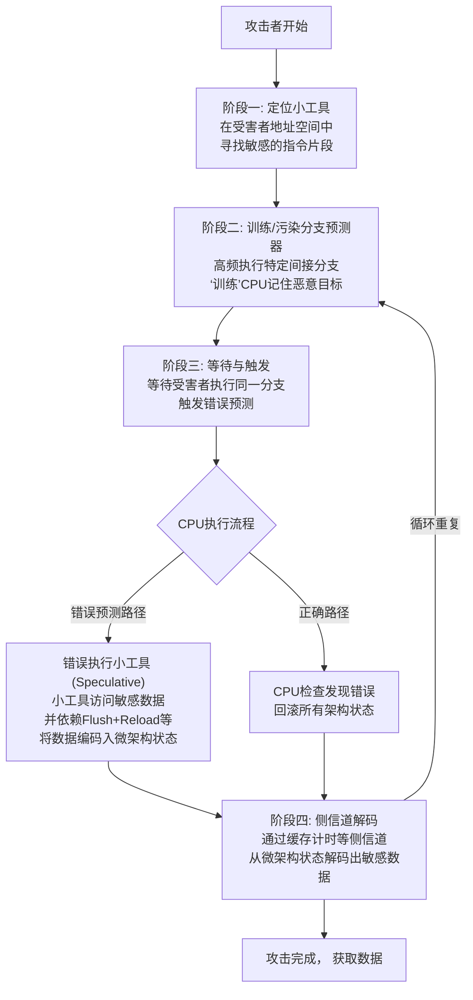

**Spectre V2 通常就是指 Spectre BTI**。

*   **Spectre V2** 是按漏洞家族内部的发现顺序编号。
*   **Spectre BTI** 则更具体地描述了其攻击机制——**B**ranch **T**arget **I**njection（分支目标注入）。

### 🔍 核心攻击原理：污染“预测地图”

将CPU的分支预测器想象成一个“**预测地图**”。当程序遇到一个像 `call *rax` 或 `jmp [r8]` 这样的**间接分支/跳转**指令时（目标地址存储在寄存器或内存中，运行时才能确定），CPU会查看这张“地图”来预测它该跳到哪里执行，从而提前开始取指和解码，实现加速。

**Spectre BTI 的攻击核心，就是通过“训练”来恶意污染这张“预测地图”**，诱使CPU在受害者执行间接跳转时，错误地预测并执行到攻击者精心准备的 **“小工具”** 代码片段。

整个攻击过程是一个精心设计的“训练-触发”循环，其核心步骤与状态流转如下图所示：



### ⚠️ 影响与严峻性

Spectre BTI 的影响极为严重，因为它打破了操作系统和虚拟机管理程序精心构建的**关键安全边界**：
*   **进程间隔离**：一个普通用户进程可以窃取另一个进程的内存数据。
*   **内核隔离**：一个用户程序可以窃取操作系统内核的敏感信息。
*   **虚拟机隔离**：一个虚拟机可以窃取同一宿主机上另一个虚拟机，甚至宿主机Hypervisor的内存数据。

### 🛡️ 主要缓解措施

由于漏洞根植于硬件，修复需要软硬件协同，且往往伴随性能开销。

1.  **软件/编译器层面：Retpoline**
    *   这是最著名的软件缓解方案。编译器将间接跳转指令（如 `call *rax`）替换为一个特殊的、不会被预测执行的代码序列（`retpoline`），**从根本上阻止了基于间接分支的预测执行被利用**。这是Linux等系统早期的主要防护手段。

2.  **硬件/微码层面（主要方向）**
    现代操作系统更倾向于利用CPU厂商通过微码更新提供的硬件功能：
    *   **间接分支限制预测**：这是Intel和AMD提供的核心硬件功能。
        *   **Intel**: 启用 **IBRS** / **IBPB** / **STIBP** 一组特性。
        *   **AMD**: 在Zen3及后续架构上提供了类似的 **`IBPB`** 和 **`STIBP`** 支持。
    *   **增强的间接分支预测器架构**：新一代CPU（如Intel的Cascade Lake以后，AMD的Zen3以后）从硬件设计上改进了预测器的隔离性。

### 📌 在AMD平台上的补充说明

AMD处理器同样受Spectre BTI影响，但情况略有不同：
*   **Zen 1 和 Zen 2**：主要依赖操作系统的软件缓解（如Retpoline）和微码更新提供的 **`IBPB`** 在关键边界（如进程切换、VMExit）进行预测器清理。
*   **Zen 3 及以上**：硬件层面进行了增强，提供了更完整的 **`IBPB`** 和 **`STIBP`** 支持，允许操作系统启用更高效的硬件级防护。

可以通过以下命令检查Linux系统的防护状态：
```bash
# 检查当前内核采用的Spectre V2缓解方案
cat /sys/devices/system/cpu/vulnerabilities/spectre_v2
```
输出可能显示为 `Retpoline`、`IBRS`、`IBPB` 等，表明系统已启用防护。
