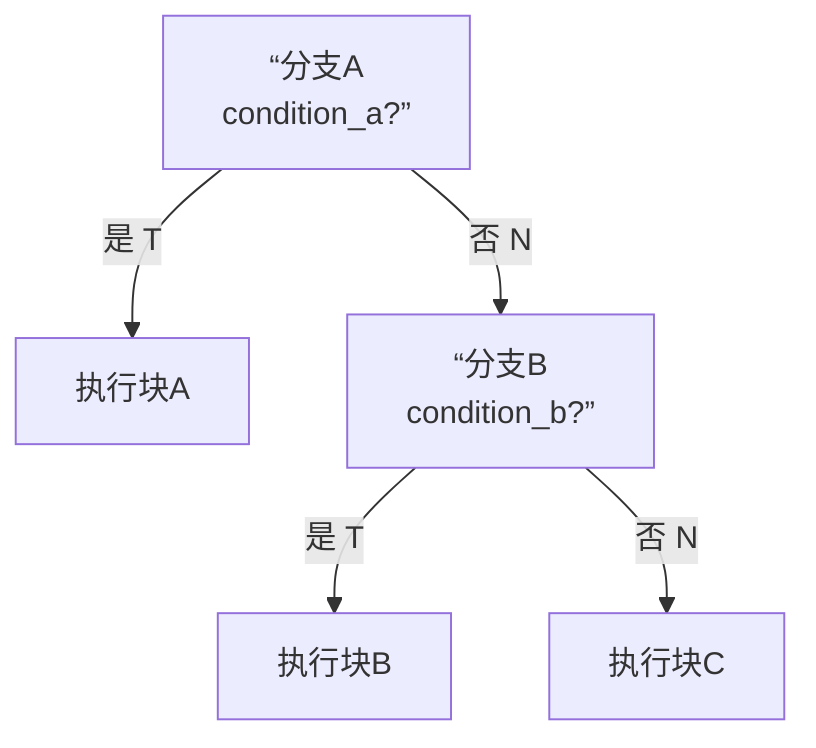

### 核心理念：为什么需要“共享”？

在理解“共享”之前，必须先明白传统分支预测器的局限：

1.  **局部分支预测器**：为**每个分支指令**（通过其PC地址）单独分配一个预测状态机（如两位饱和计数器）。它只记得“这个分支自己过去是跳转还是不跳转”。
    *   **缺点**：它完全**忽略**了程序中其他分支的执行结果。然而，程序中分支之间往往存在强烈的相关性。
2.  **全局分支预测器**：维护一个**统一的、全局的分支历史寄存器**，记录最近发生的所有分支的方向（跳转T/不跳转N）。它用这个**全局历史模式**去查表预测下一个分支。
    *   **缺点**：所有分支共享同一个历史记录，当两个不相关的分支先后执行时，历史模式容易被“污染”。

**共享分支预测器的核心思想**，就是聪明地**在不同分支间共享信息和硬件资源**，以更高的准确率和更低的硬件成本，捕捉更复杂的**分支间相关性**。

---

### 原理详解：两个层面的“共享”

#### 1. 历史记录的共享：全局分支历史寄存器

这是最基础的共享。所有分支指令的执行结果（跳转/不跳转）都被压入一个**全局分支历史寄存器**中。这意味着：
*   **分支A**的预测，会参考在它之前刚刚执行完的**分支B、C、D...** 的方向。
*   这成功捕捉了“**if-else链**”、“**循环嵌套**”等场景下的分支相关性。

#### 2. 预测状态机的共享：通过哈希函数索引公共表

这是“共享”的精髓所在。预测器不再为每个分支指令单独分配私有的状态机，而是维护一个**所有分支共享的大型模式历史表**（PHT）。如何为当前分支在这个共享表中找到对应的预测项呢？

*   **关键操作**：将当前分支的**PC地址**与**全局历史寄存器**的内容进行一个**哈希运算**（通常是非常快速的按位异或和移位操作），生成一个唯一的索引，用这个索引去查询共享的PHT。
*   **为什么这样更高效**：假设有N条分支指令，每条分支有M种可能的历史模式。如果为每条分支的每种模式都单独配置预测器，需要 N x M 个状态机，硬件开销巨大。而共享预测器通过哈希，只需要一个约 `K`（K远小于NxM） 个条目的PHT，所有分支的所有模式都**竞争式地共享使用这K个状态机**。

---

### 一个具体例子：“if-else if” 模式

假设有这样一段C代码：
```c
if (condition_a) {
    // 块A
} else if (condition_b) {
    // 块B
} else {
    // 块C
}
```
其对应的简化汇编和控制流如下图所示：



现在，我们来看一个**共享的、基于全局历史的预测器**如何工作：

1.  **初始状态**：全局历史寄存器`GHR`为空（假设为`...000`）。PHT中的所有预测状态机初始化为“弱不跳转”。

2.  **第一次执行（condition_a为真）**：
    *   遇到**分支A**，计算索引 `Hash(PC_A, GHR)`， 查共享PHT得到预测（假设为“不跳转”，预测错误）。
    *   实际执行：`condition_a`为真，**跳转**到块A。
    *   **更新**：`GHR`被左移，最低位记录`T`（跳转），变成`...001`。同时，用索引`Hash(PC_A, old_GHR)`找到PHT中对应的状态机，将其更新为“强跳转”。

3.  **第二次执行（condition_a为假，condition_b为真）**：
    *   再次遇到**分支A**。此时`GHR`可能已是其他值，但假设我们回到程序开头，`GHR`被清空。
    *   预测分支A（可能再次预测不跳转）。实际执行：`condition_a`为假，**不跳转**，于是走到分支B。
    *   遇到**分支B**。计算索引 `Hash(PC_B, GHR)`。**关键点来了**：此时`GHR`记录了分支A刚刚是“不跳转”（`N`），假设为`...010`。
    *   这个索引 `Hash(PC_B, GHR='...010')` **唯一地对应了“在分支A不跳转之后，遇到分支B”这种程序上下文**。
    *   查PHT预测分支B。由于之前可能学习过这种模式，PHT可能给出“跳转”预测（因为`condition_b`为真）。
    *   实际执行：`condition_b`为真，**跳转**到块B。预测正确！更新`GHR`为`...101`（A跳转N， B跳转T），并强化PHT中对应项。

**共享的威力**：
在这个例子中，**分支B的预测准确率，依赖于之前分支A的结果**。共享预测器通过`GHR`捕捉到了这种“`if-else if`”的相关性。更重要的是，`PC_B`和`GHR`哈希后得到的索引，可能和程序中**另一个完全不同的分支X在某种历史模式下的索引相同**，它们会**共享PHT中的同一个预测状态机**。这种竞争在资源有限的情况下是值得的，因为程序流中大量的分支上下文可以被有限的硬件资源所覆盖。

---

### 现代CPU中的实际应用：融合与创新

*   **Intel的“锦标赛预测器”**：它实际上包含**多个**不同的预测器（如一个基于全局历史的，一个基于局部历史的），并有一个**元预测器**来动态决定对当前分支相信哪个预测器的结果。这里的“共享”是更高级的策略共享。
*   **AMD和ARM的设计**：广泛使用了**感知机预测器**的变种，这是一种更复杂的共享结构，使用带权重的全局历史和PC哈希来做出预测。

**总结来说，共享分支预测器的精髓在于：**
1.  **共享全局历史**：让所有分支看到完整的执行上下文。
2.  **共享预测硬件**：通过PC与全局历史的哈希，让不同的分支在不同的上下文下，高效、竞争性地复用同一批预测状态机。
3.  **目的**：以可接受的硬件成本，大幅提升对复杂分支行为（尤其是分支间相关）的预测准确率，从而保持CPU流水线的高效运转。
