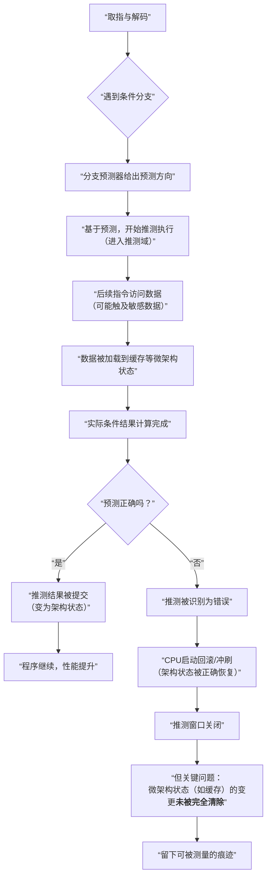

在硬件安全领域，**推测窗口**是现代CPU微架构中一个至关重要的概念，它是**推测执行类侧信道攻击**得以实现的核心时间条件。

简单来说：**推测窗口是指CPU在错误地推测执行了本不该执行的指令后，从开始执行到最终发现错误并撤销所有影响的这段“短暂的、但暴露漏洞的”时间窗口。**

要透彻理解它，我们需要拆解CPU的工作流程。

### 核心原理与产生机制

下图描绘了CPU正常执行与推测执行流程的关键区别，以及推测窗口是如何产生的：

让我们对上图中的几个关键环节进行详细解释：

1.  **正常流程 vs. 推测流程**：如左路所示，在传统CPU中，指令必须按顺序、在条件明确后才执行。现代CPU为了高性能，引入了**推测执行**：当遇到一个条件分支（如 `if` 语句）时，不等条件计算完成，就根据历史记录**预测**一个方向，并立即开始执行预测路径上的指令。这被称为进入了“推测域”。

2.  **推测窗口的开启**：从CPU开始执行预测路径上的指令那一刻起，**推测窗口就打开了**。在此期间，被推测执行的指令可以正常进行内存读取、运算等操作，甚至可能**访问到本程序（或内核、其他程序）的敏感数据**。

3.  **关键的安全问题**：虽然CPU在架构层面（如寄存器、内存内容）保证了“推测执行的结果在确认正确前绝不提交”，但在**微架构层面**，推测执行的指令已经留下了难以彻底清除的**痕迹**，最主要的就是**缓存状态的变化**。

4.  **推测窗口的关闭与漏洞产生**：当CPU终于计算出分支条件的真实结果后：
    *   **如果预测正确**：推测窗口关闭，所有推测结果被提交，性能提升。
    *   **如果预测错误**（这是攻击者故意诱发的）：CPU会立刻**关闭推测窗口**，并**在架构层面回滚所有推测执行的结果**，看起来一切从未发生。
    *   **然而，漏洞就在这里**：被错误推测执行的指令所改变的**缓存状态**，并不会被完全还原。攻击者之前无权访问的敏感数据，已经被加载到了共享缓存中。

### 为什么推测窗口是攻击的枢纽？

攻击者（通过一个恶意程序）可以：
1.  **操纵分支预测**：精心构造代码，训练CPU的预测器，使其在特定时刻做出一个**确定性的错误预测**。
2.  **在推测窗口内植入“探针”**：在错误预测的路径上，放置一条指令，该指令的行为（如访问某个数组元素的速度）取决于某个**秘密值**（如密码的一个字节）。
3.  **测量缓存痕迹**：推测窗口关闭后，攻击者通过**缓存侧信道**（如测量访问时间）来探测“探针”指令留下的缓存痕迹，从而**逆向推算出敏感秘密数据的内容**。

整个攻击链条的**唯一时机**，就发生在这个短暂（通常为几十到几百个CPU时钟周期）的**推测窗口**之内。

### 防御思路：缩短或隔离推测窗口

现代缓解措施的核心思想都围绕着这个窗口：
1.  **减少窗口长度**：让CPU更快地验证分支预测结果，缩短可供攻击者利用的窗口时间。但这种方法治标不治本。
2.  **在窗口内实施数据隔离**：
    *   **延迟暴露**：让推测执行的指令在真正提交前，无法将数据加载到共享缓存中。例如，Intel的**L1D缓存延迟分配**技术。
    *   **秘密无关执行**：更根本的解决思路是让推测执行路径上的指令**无法访问到与其权限不符的秘密数据**。这涉及更复杂的硬件设计，如**推测屏障**、**影子内存标签**等，是当前硬件安全研究的前沿。

### 一个简单的类比
想象一个严格的办事流程：职员必须看到领导签字（**条件结果**）后才能盖章（**提交结果**）。为了提速，职员会**预测**领导会签字，并提前把公章从保险柜（**慢速存储**）拿出来放在桌上（**缓存**），甚至提前按在文件上，但**不松手（不提交）**。
*   **推测窗口**：从把公章拿出来到等待领导最终决定的这段时间。
*   **攻击**：攻击者故意让领导不签字。职员必须把没生效的文件销毁（**架构回滚**），并把公章收回去。但攻击者可以通过事后检查桌上是否有印泥痕迹（**侧信道测量**），来推断职员当时准备盖章的是哪份文件（**触及了秘密**）。

总结来说，**推测窗口是CPU在追求极致性能（推测执行）时，在微架构层面无意打开的一个短暂且不安全的状态暴露期**。它成为了Spectre等硬件安全漏洞的根源，而现代处理器安全设计正致力于更好地管理和隔离这个窗口。

