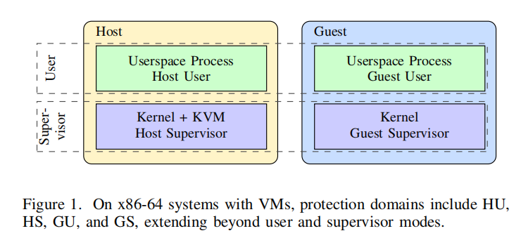

# 详解图片：

## 图片详解：虚拟化环境下的保护域架构

---

### 一、图像解构：四层嵌套的保护模型

这张图揭示了一个**关键认知**：在虚拟化世界，传统的"用户态 vs 内核态"二元模型已扩展为**四元保护域**。让我们逐层剥开：

```
┌─────────────────────────────────────┐
│  Host（宿主机物理机）               │
│  ┌─────────────────────────────────┐ │
│  │  Host Userspace Process         │ │ ← HU (Host User)
│  │  宿主机用户空间进程              │ │
│  └─────────────────────────────────┘ │
│  ┌─────────────────────────────────┐ │
│  │  Host Kernel + KVM              │ │ ← HS (Host Supervisor)
│  │  宿主机内核（含KVM模块）         │ │
│  └─────────────────────────────────┘ │
└─────────────────────────────────────┘
            ↑
            │ KVM虚拟化层
            ↓
┌─────────────────────────────────────┐
│  Guest（客户机虚拟机）              │
│  ┌─────────────────────────────────┐ │
│  │  Guest Userspace Process        │ │ ← GU (Guest User)
│  │  虚拟机用户空间进程              │ │
│  └─────────────────────────────────┘ │
│  ┌─────────────────────────────────┐ │
│  │  Guest Kernel                   │ │ ← GS (Guest Supervisor)
│  │  虚拟机内核                      │ │
│  └─────────────────────────────────┘ │
└─────────────────────────────────────┘
```

---

### 二、四个保护域（Protection Domains）详解

#### **HU (Host User) - 宿主机用户**
- **权限**：最低，普通用户进程（如你的浏览器、编辑器）
- **隔离**：通过进程地址空间、MMU页表隔离
- **攻击视角**：若能突破HU→HS，即传统的**本地提权**

#### **HS (Host Supervisor) - 宿主机内核**
- **权限**：最高，完全控制系统硬件
- **组成**：Linux内核 + **KVM模块**（关键！）
- **隔离**：通过SVM/VMX硬件虚拟化指令强制隔离Guest
- **攻击视角**：若能突破HS→Host固件/Intel ME，即**Ring -2攻击**

#### **GU (Guest User) - 虚拟机用户**
- **权限**：受限，虚拟机内的普通进程
- **特点**：感知不到自己运行在虚拟机中
- **隔离**：由Guest Kernel的页表隔离
- **攻击视角**：突破GU→GS，即虚拟机**内部提权**

#### **GS (Guest Supervisor) - 虚拟机内核**
- **权限**：虚拟机的"最高权限"，但对Host来说仍是用户态
- **限制**：所有特权指令（如`wrmsr`）被**KVM拦截**（VM-Exit）
- **隔离**：由KVM维护的影子页表/EPT隔离
- **攻击视角**：突破GS→HS，即**虚拟机逃逸**（最危险！）

---

### 三、KVM为何出现？虚拟化的"翻译官"

**KVM (Kernel-based Virtual Machine)** 是**Linux内核的一个模块**，它将内核变成了**虚拟机监控器（Hypervisor）**。

#### **KVM的核心职责**

```c
// 伪代码：KVM的核心循环
while (guest_running) {
    // 1. 进入Guest模式
    vmrun(guest_state);  // AMD指令，Intel对应vmx_nonroot
    
    // 2. 当Guest执行特权指令时，触发VM-Exit
    if (exit_reason == VM_EXIT_MSR) {
        // KVM模拟MSR读写，防止Guest操纵真实硬件
        kvm_emulate_msr();
    } else if (exit_reason == VM_EXIT_CPUID) {
        // KVM伪造CPUID结果，让Guest以为自己独占CPU
        kvm_emulate_cpuid();
    }
    
    // 3. 调度下一个vCPU
    schedule();
}
```

#### **为何图中KVM属于HS而非独立层？**

这是 **"宿主式虚拟化"** 架构的特点：
- **KVM不是独立软件**，而是**内核代码的一部分**（`kvm.ko`）
- 它复用Linux内核的**调度、内存管理、设备驱动**
- 相比裸金属Hypervisor（如Xen），架构更简洁，性能更好

**类比**：KVM就像**会说外语（Guest指令）的酒店前台**，帮外国游客（Guest OS）办理入住，但所有决策最终由酒店经理（Host Kernel）批准。

---

### 四、这张图对侧信道攻击的意义

#### **攻击面的指数级扩张**

传统系统：攻击路径只有 `User → Kernel`  
虚拟化系统：攻击路径有 **4×4=16种跨域可能**，其中6种是高风险：

1. **GU → GS**（VM内提权）
2. **GU → HU**（跨VM窃取）
3. **GU → HS**（VM逃逸）
4. **GS → HS**（VM逃逸）
5. **HU → HS**（宿主机提权）
6. **GU₁ → GU₂**（跨VM侧信道）

#### **微架构资源共享：永恒的安全矛盾**

| 硬件资源      | 是否跨域共享           | 攻击类型                  | 你的课题相关性 |
| ------------- | ---------------------- | ------------------------- | -------------- |
| L3缓存        | **是**（所有Domain）   | Flush+Reload, Prime+Probe | ⭐⭐⭐⭐⭐          |
| BTB分支预测器 | **是**（同物理CPU）    | Spectre V1/V2             | ⭐⭐⭐⭐           |
| 执行端口      | **是**（同核心SMT）    | PortSmash                 | ⭐⭐             |
| 向量寄存器    | **是**（Zen2延迟清除） | Zenbleed                  | ⭐⭐⭐⭐           |
| L1/L2缓存     | **否**（核心私有）     | L1 Prime+Probe            | ⭐⭐             |

**结论**：这张图说明，**虚拟化并未真正隔离硬件资源**，反而引入了更复杂的**跨域侧信道攻击面**。

---

### 五、与课题"AMD测信道案例"的直接关联

#### **KVM环境下的攻击放大效应**

在KVM虚拟化中，侧信道攻击更危险：

**场景1：Flush+Reload跨VM窃取**

- **攻击者**：Guest1的GU进程（恶意租户）
- **受害者**：Guest2的GU进程（存放AES密钥）
- **机制**：两者共享**Host的L3缓存**，通过Prime+Probe感知Guest2的访问模式
- **威胁**：云平台多租户隔离失效

**场景2：Spectre V2从Guest攻向Host**

- **攻击者**：Guest内核（GS）中的恶意驱动
- **受害者**：Host内核（HS）的KVM模块
- **机制**：BTB污染 → KVM的间接调用被推测执行 → Host内存泄露
- **威胁**：**虚拟机逃逸**（云安全灾难）
