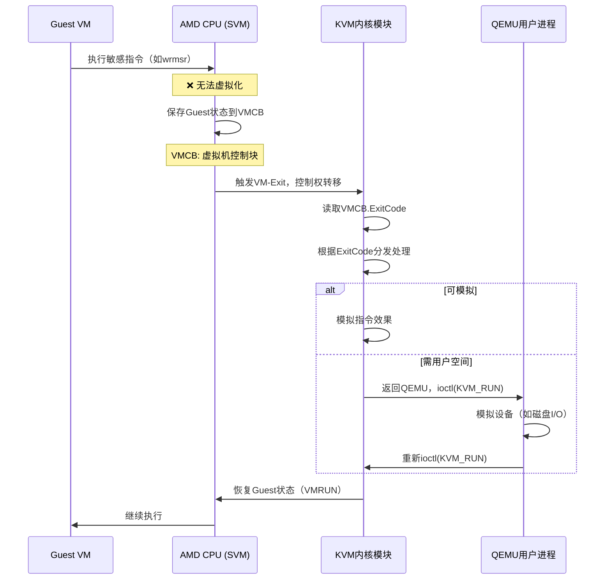
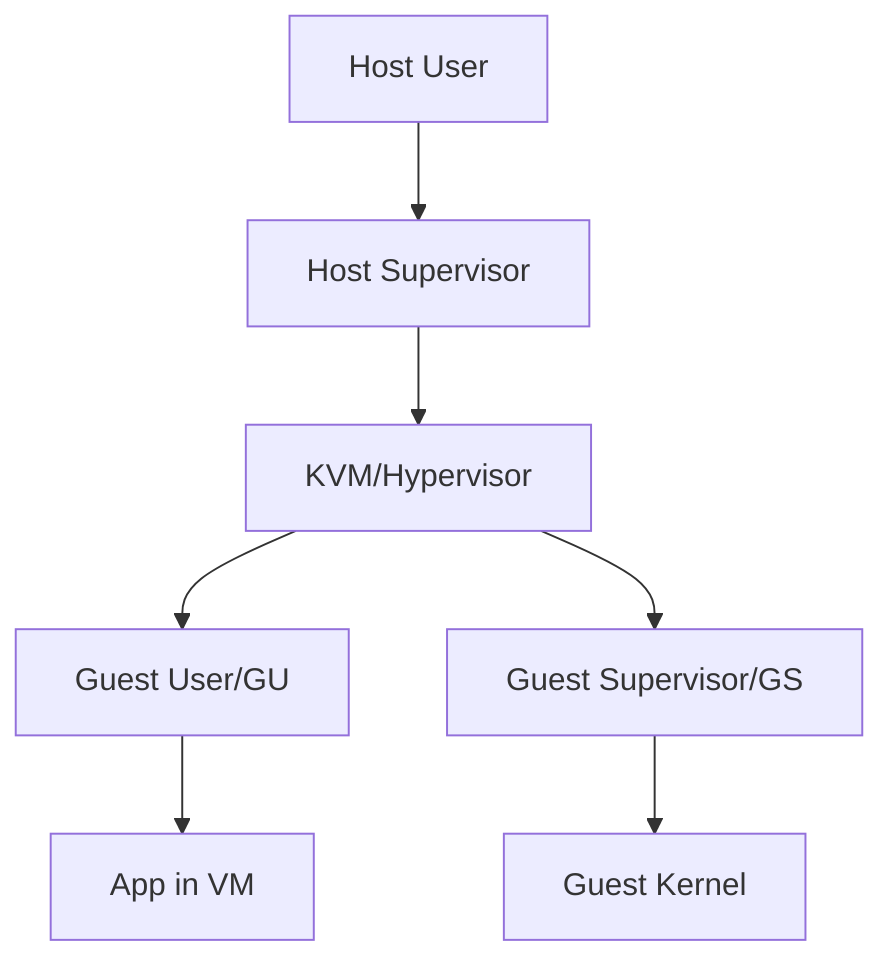

# VM-Exit、KVM 与 Hypervisor-User 全景解析

---

## 一、基础概念：虚拟化的三大支柱

### **1.1 Hypervisor（虚拟机监控器）**
**定义**：运行在裸金属硬件或宿主机操作系统之上的**特权软件层**，负责创建、管理和调度虚拟机。

**类比**：Hypervisor是**酒店经理**，虚拟机是**住客房间**，管理钥匙、水电、安全。

**分类**：
- **Type-1（裸金属）**：VMware ESXi, Xen, Hyper-V（直接运行在硬件上）
- **Type-2（宿主式）**：KVM, VirtualBox（运行在Linux/Windows内核上）

---

### **1.2 KVM（Kernel-based Virtual Machine）**
**定义**：**KVM不是独立的Hypervisor，而是Linux内核的一个模块**（`kvm.ko`），它**将Linux内核自身变成Type-1 Hypervisor**。

**核心特性**：
- **内核模块**：`kvm.ko` + `kvm-amd.ko` 或 `kvm-intel.ko`
- **硬件辅助**：依赖CPU虚拟化扩展（AMD-V或Intel VT-x）
- **复用内核**：直接使用Linux的调度、内存管理、设备驱动

**架构图**：
```
┌─────────────────────────────────────┐
│      User Space（用户空间）          │
│  ┌─────────────┐  ┌─────────────┐  │
│  │  QEMU       │  │  libvirt    │  │
│  │  设备模拟   │  │  管理API    │  │
│  └──────┬──────┘  └──────┬──────┘  │
│         │                │          │
└─────────┼────────────────┼──────────┘
          │                │
          │ ioctl()        │
┌─────────▼────────────────▼──────────┐
│      Kernel Space（内核空间）        │
│  ┌─────────────────────────────────┐│
│  │      KVM模块（kvm.ko）           ││
│  │  - VM创建/销毁                  ││
│  │  - VCPU调度                     ││
│  │  - 内存虚拟化（EPT/NPT）        ││
│  └──────────┬──────────────────────┘│
│             │                       │
│  ┌──────────▼──────────────────────┐│
│  │  硬件驱动（kvm-amd.ko）          ││
│  │  - VMRUN指令                    ││
│  │  - VM-Exit处理                  ││
│  └──────────┬──────────────────────┘│
└─────────────┼───────────────────────┘
              │
┌─────────────▼───────────────────────┐
│  Hardware（硬件层）                  │
│  AMD EPYC 7543 (SVM)               │
└─────────────────────────────────────┘
```

** 关键 **：KVM既是** Hypervisor **，也是** 内核的一部分 **。用户通过`ioctl()`系统调用与KVM交互。

---

### ** 1.3 VM-Exit（虚拟机退出） **
** 定义 **：当Guest VM执行了** 敏感指令 **（如访问物理设备、修改页表）时，CPU** 自动暂停**VM的执行，将控制权**交还 **给Host Hypervisor（KVM）的过程。

** 类比 **：酒店住客（VM）试图闯入经理办公室（访问硬件），** 门禁报警 **（VM-Exit），经理（KVM）前来处理。

** AMD术语**：VM-Exit对应`VMRUN`指令的退出，Intel对应`VMLAUNCH/VMRESUME`。

---

## 二、VM-Exit 详解：触发、处理与性能

### **2.1 触发条件（AMD SVM）**

**VM-Exit根本原因**：Guest执行了**无法虚拟化**或**需要Host介入**的指令。

| 触发类别     | 具体指令/事件               | 退出原因码（Exit Code） | 你的课题相关性 |
| ------------ | --------------------------- | ----------------------- | -------------- |
| **敏感指令** | `wrmsr`, `cpuid`, `invd`    | 0x7B, 0x72, 0x25        | ⭐⭐⭐⭐⭐          |
| **内存管理** | 页表修改（CR3写）           | 0x3F                    | ⭐⭐⭐⭐           |
| **I/O访问**  | `in`, `out`指令             | 0x1C, 0x1D              | ⭐⭐             |
| **中断**     | 外部中断、NMI               | 0x60, 0x61              | ⭐⭐             |
| **侧信道**   | **L3缓存未命中**（#DB异常） | 0x01                    | ⭐⭐⭐⭐⭐          |
| **虚拟化**   | VMRUN（嵌套虚拟化）         | 0x0A                    | ⭐⭐             |

**你的课题关键**：在**侧信道攻击**中，VM-Exit本身会成为**噪声源**（干扰rdtsc计时），但也是**攻击面**（跨VM Flush+Reload通过共享L3触发VM-Exit）。

---

### **2.2 VM-Exit 处理流程（AMD-V）**



**关键寄存器**：
- **VMCB**（Virtual Machine Control Block）：保存Guest所有状态（CS:RIP, RAX, CR3, EFER等）
- **EXITCODE**：VM-Exit原因（如0x7B=WRMSR）
- **EXITINFO1/2**：额外信息（如MSR地址）

---

### **2.3 VM-Exit 性能影响**

**代价**：每次VM-Exit消耗 **1500-2500 CPU周期**（约1-2微秒）

**优化技术**：
1. **Exitless**：将频繁操作（如页表更新）委托给Guest（需硬件支持）
2. **批处理**：合并多个I/O请求
3. **TDP（Two-Dimensional Paging）**：减少EPT Violation退出

**性能对比**：
| 操作        | 裸金属性能 | 虚拟化性能（含VM-Exit） | 损耗      |
| ----------- | ---------- | ----------------------- | --------- |
| 页表更新    | 50ns       | 1200ns (VM-Exit×2)      | ** 24× ** |
| I/O端口访问 | 100ns      | 1800ns                  | ** 18× ** |
| rdtsc       | 25ns       | 30ns (无需Exit)         | 1.2×      |

** 你的课题影响 **：频繁的VM-Exit会** 抖动rdtsc计时 **，需在实验中** 禁用NMI，绑定CPU **，或** 使用TSC偏移虚拟化 **。

---

### ** 2.4 查看VM-Exit次数（实践） **

```bash
# 1. 启用KVM调试
echo 1 > /sys/module/kvm/parameters/debug

# 2. 查看VM-Exit统计（需root）
cat /sys/kernel/debug/kvm/exits
# 输出示例：
# MSR_WRITE: 12345
# IO_INSTRUCTION: 6789
# EPT_VIOLATION: 2345

# 3. 使用perf监控VM-Exit事件
perf stat -e kvm:kvm_entry,kvm:kvm_exit -a sleep 10
# 输出：
# 12,345 kvm:kvm_entry
# 12,345 kvm:kvm_exit  # 进出相等

# 4. 查看VMCS/VMCB内容（调试）
# 在QEMU中：
# (gdb) p/x *(struct vmcb*)vcpu->arch.hvm_svm.vmcb
```

---

## 三、Hypervisor-User：概念的澄清与定位

### **3.1 术语辨析**

"Hypervisor-User"**并非标准术语**，可能指代以下**三个不同层次**：

#### **层次1：KVM的用户空间接口（最可能）**
**定位**：用户态程序（如QEMU）通过`ioctl()`与KVM内核模块交互的角色。

**核心API**：
```c
// 创建VM
int kvm_fd = open("/dev/kvm", O_RDWR);
int vm_fd = ioctl(kvm_fd, KVM_CREATE_VM, 0);

// 创建VCPU
int vcpu_fd = ioctl(vm_fd, KVM_CREATE_VCPU, 0);

// 运行VM
struct kvm_run *run = mmap(..., vcpu_fd);
while (1) {
    ioctl(vcpu_fd, KVM_RUN, 0);  // 进入Guest，直到VM-Exit
    
    // 处理VM-Exit
    switch (run->exit_reason) {
        case KVM_EXIT_IO: /* ... */ break;
        case KVM_EXIT_MMIO: /* ... */ break;
        case KVM_EXIT_RDMSR: /* ... */ break;
    }
}
```

**关系**：QEMU是**Hypervisor-User**，KVM是**Hypervisor-Kernel**。

---

#### **层次2：虚拟化环境下的"Guest User"**
**定位**：在虚拟化层级中，与"Guest Supervisor"相对的概念。



**你的课题相关性**：在**跨VM侧信道攻击**中，攻击者是**Guest User (GU)**，受害者也是**Guest User (GU)**，通过共享的L3缓存（Host Supervisor层）泄露信息。

---

#### **层次3：像Hypervisor一样运行的用户态程序（罕见）**
**定位**：利用**嵌套虚拟化**技术，在用户态实现一个微型Hypervisor（如**Firecracker**）。

**AMD实现**：
```c
// 用户态VMRUN (需内核支持nested)
struct svm_user_vmrun {
    uint64_t vmcb_pa;  // 物理地址
    uint64_t rip;      // 入口地址
};
ioctl(kvm_fd, KVM_SVM_VMRUN, &vmrun);
```

**你的课题**：若研究**嵌套虚拟化的侧信道**，需要理解这一层。

---

## 四、三者关系全景图

```mermaid
graph TD
    subgraph User Space
        A[QEMU/Cloud-Hypervisor] --> B[ioctl(KVM_RUN)]
        B --> C[KVM_RUN loop]
        C --> D{VM-Exit?}
    end
    
    subgraph Kernel Space
        E[KVM内核模块] --> F[KVM_RUN handler]
        F --> G[VMRUN指令]
        G --> H[Guest VM执行]
        H --> I{敏感指令?}
        I -->|是| J[VM-Exit]
        I -->|否| H
        J --> K[Exit Handler]
        K --> L[VMCB分析]
        L --> M[返回QEMU]
    end
    
    subgraph Hardware
        N[AMD CPU SVM] --> O[VMRUN]
        O --> P[Guest State加载]
        P --> Q[执行]
        Q --> R[Exit原因码写入VMCB]
        R --> S[返回KVM]
    end
    
    M --> B
    S --> K
    
    style A fill:#e1f5ff
    style E fill:#ffe1e1
    style N fill:#e1ffe1
    
    subgraph Hypervisor-User层
        A
    end
    
    subgraph Hypervisor-Kernel层
        E
    end
    
    subgraph VM-Exit机制
        J
    end
```

**协作流程**：
1. **Hypervisor-User**（QEMU）调用`ioctl(KVM_RUN)`
2. **KVM**（内核）执行`VMRUN`指令，CPU进入Guest模式
3. **Guest**执行敏感指令 → CPU触发**VM-Exit**
4. **KVM**读取VMCB.ExitCode → 模拟或返回QEMU
5. **QEMU**处理I/O → 再次`KVM_RUN`

---

## 五、AMD平台特异性（对你的课题至关重要）

### **5.1 AMD SVM vs Intel VMX**

| 特性             | AMD SVM                 | Intel VMX         | 你的课题影响            |
| ---------------- | ----------------------- | ----------------- | ----------------------- |
| ** 指令 **       | VMRUN                   | VMLAUNCH/VMRESUME | 汇编调试不同            |
| ** 结构 **       | VMCB (4KB物理页)        | VMCS (影子结构)   | VMCB更易直接读取        |
| ** Exit码 **     | 64位，直接编码          | 32位，需查表      | AMD更简单               |
| ** 嵌套虚拟化 ** | NPT (Nested Page Table) | EPT               | AMD NPT对侧信道影响更大 |
| ** 性能计数器 ** | 完全开放                | 部分隐藏          | AMD更易监控VM-Exit      |

### ** 5.2 AMD VM-Exit 与侧信道攻击 **

** 攻击场景 **：跨VM Flush+Reload
- ** 触发 **：Guest0攻击者Flush共享内存 → Guest1受害者访问 → ** L3未命中触发VM-Exit **
- ** 噪声 **：VM-Exit处理延迟（1-2μs）** 掩盖 **了缓存命中/未命中的时间差
- ** 绕过 **：使用 ** rdpru**指令读取`0xC0000103`（UCC寄存器），绕过VM-Exit直接访问硬件计数器

**你的毕设优化**：
```c
// 在VM中直接读取AMD性能计数器，避免VM-Exit
uint64_t read_amd_counter() {
    uint32_t low, high;
    asm volatile(
        "rdpru" 
        : "=a"(low), "=d"(high) 
        : "c"(0xC0000103)  // UCC寄存器
    );
    return ((uint64_t)high << 32) | low;
}
```

---

### **5.3 AMD NPT（Nested Page Table）与缓存攻击**

**NPT结构**：
```
Guest虚拟地址 → Guest页表（CR3）→ Guest物理地址 → NPT → Host物理地址
```

**侧信道利用**：
- **NPT Walk**：页表遍历需访问**4次内存**，每次都可能L3未命中 → **4个VM-Exit机会**
- **TLB污染**：攻击者可构造**NPT冲突**，强制Guest页表条目被驱逐 → 延迟↑ → **可测量**

**你的课题**：在AMD平台复现 **NPT Walking攻击**（USENIX'22论文），量化VM-Exit次数与缓存泄露的相关性。

---

## 六、实践操作：从用户角度看三者

### **6.1 作为用户（Hypervisor-User）**

```bash
# 1. 创建VM（QEMU）
qemu-system-x86_64 \
  -enable-kvm \              # 启用KVM
  -cpu host,migratable=no \  # 暴露主机CPU特性
  -smp 2 \                   # 2个vCPU
  -m 4G \
  -drive file=vm.img,if=virtio

# 2. 观察VM-Exit（实时）
# 在Host上：
sudo perf top -e kvm:kvm_exit
# 按"z"显示调用链，看哪个vCPU触发最多Exit

# 3. 进入VM内部（Guest）
# 在VM中：
grep -E "vmx|svm" /proc/cpuinfo  # 确认虚拟化特性暴露
```

### **6.2 作为开发者（KVM内核模块）**

```c
// 自定义VM-Exit处理（需编译内核模块）
static int handle_vmexit(struct kvm_vcpu *vcpu) {
    struct vmcb *vmcb = vcpu->arch.svm->vmcb;
    uint64_t exit_code = vmcb->control.exit_code;
    
    // 拦截MSR读取（侧信道攻击常用）
    if (exit_code == SVM_EXIT_MSR) {
        uint32_t msr = vmcb->control.exit_info_1;
        if (msr == MSR_IA32_TSC) {  // 时间戳计数器
            printk("Guest试图读取TSC，可能在做计时攻击！\n");
            // 可返回污染过的TSC值
        }
    }
    return 0;
}
```

### **6.3 作为攻击者（侧信道利用）**

```bash
# 在Guest VM中测量VM-Exit延迟
# 攻击者：频繁触发VM-Exit（如wrmsr）
# 受害者：访问密钥
# 攻击者：测量触发VM-Exit的时间差

# 使用kvmtrace工具
sudo kvmtrace -p <kvm_vm_pid> -e vmexit
# 分析VM-Exit模式，寻找密钥访问的"指纹"
```

---

## 七、三者在侧信道攻击中的角色

### **7.1 攻击者视角：利用VM-Exit泄露信息**

**场景**：跨VM攻击中，受害者访问密钥触发**EPT Violation** → VM-Exit → **可测量延迟**

```c
// 受害者VM（Guest）
void encrypt(uint8_t *key) {
    for (int i = 0; i < 16; i++) {
        // 访问 key[i] → 可能触发EPT Violation
        uint8_t k = key[i];
    }
}

// 攻击者VM（Guest）
void attacker() {
    // 1. Flush密钥对应的EPT条目
    asm volatile("invlpg (%0)" : : "r"(&key));
    
    // 2. 等待受害者访问
    
    // 3. 测量访问时间（若慢→说明触发了VM-Exit→受害者访问过）
}
```

### **7.2 防御者视角：减少VM-Exit噪声**

**优化**：
1. **大页（Huge Page）**：减少EPT层次，降低Exit次数
   ```bash
   echo always > /sys/kernel/mm/transparent_hugepage/enabled
   ```
2. **Exitless Patching**：将频繁Exit操作委托给Guest
3. **TSC虚拟化**：`kvm-clock`源，减少TSC读取Exit

---

## 八、总结：三者的关系与定位

| 概念                | 全称                         | 所在层级          | 核心功能              | 你的毕设作用            |
| ------------------- | ---------------------------- | ----------------- | --------------------- | ----------------------- |
| **KVM**             | Kernel-based Virtual Machine | **内核模块**      | 将Linux变为Hypervisor | 提供虚拟化测试环境      |
| **VM-Exit**         | Virtual Machine Exit         | **硬件-内核交接** | Guest→Host控制权转移  | **攻击噪声源/攻击面**   |
| **Hypervisor-User** | Hypervisor用户空间接口       | **用户进程**      | 与KVM交互（QEMU）     | **实验控制层/攻击载体** |

**一句话串联**：**Hypervisor-User**（QEMU）通过**KVM**让CPU进入Guest，Guest执行敏感指令触发**VM-Exit**，返回KVM处理，这个循环的时序特性可被侧信道攻击利用。

---

## 九、实践清单：今晚可做的事

1. **确认KVM加载**：
   ```bash
   lsmod | grep kvm
   # 应显示 kvm, kvm_amd
   ```

2. **查看VM-Exit统计**：
   ```bash
   sudo perf stat -e 'kvm:*' -a sleep 5
   ```

3. **创建测试VM**：
   ```bash
   qemu-system-x86_64 -enable-kvm -smp 1 -m 1G -cdrom ubuntu.iso
   # 在另一个终端监控VM-Exit
   sudo perf top -p $(pgrep qemu)
   ```

4. **编写最小KVM用户程序**：
   ```c
   // kvm_hello.c - 创建并运行一个最小VM
   #include <linux/kvm.h>
   int main() {
       int kvm = open("/dev/kvm", O_RDWR);
       int vm = ioctl(kvm, KVM_CREATE_VM, 0);
       int vcpu = ioctl(vm, KVM_CREATE_VCPU, 0);
       // ... 设置段寄存器，加载代码
       ioctl(vcpu, KVM_RUN, 0);  // 触发VM-Exit
   }
   ```
