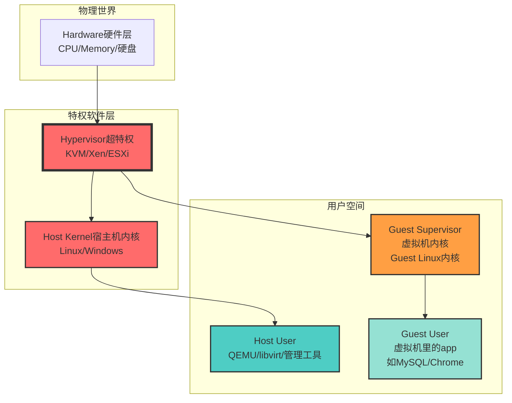

# Host/Guest/Hypervisor/User 四元组详解

---

## 一、四个核心概念：先拆成"物理 vs 虚拟"

| 概念           | 全称         | 本质                                  | 类比                 |
| -------------- | ------------ | ------------------------------------- | -------------------- |
| **Host**       | 宿主机       | **物理存在的计算机**（硬件+操作系统） | **整栋酒店大楼**     |
| **Guest**      | 客户机       | **虚拟出来的计算机**（VM虚拟机）      | **酒店里的一间客房** |
| **Hypervisor** | 虚拟机监控器 | **管理虚拟机的软件/内核模块**         | **酒店经理**         |
| **User**       | 用户空间     | **运行应用程序的普通权限**            | **酒店住客**         |

**关键区分**：
- **Host/Guest** = **物理/虚拟**的计算机（ENTITY 实体）
- **Hypervisor/User** = **特权/普通**的软件运行模式（ROLE 角色）

---

## 二、层级关系金字塔（从硬件到应用）



**权限等级**：
- **Hypervisor**（Ring -1）：最高，控制所有物理资源
- **Host Kernel**（Ring 0）：次高，管理Host硬件
- **Guest Supervisor**（虚拟Ring 0）：看似高权限，但受Hypervisor管控
- **Host/Guest User**（Ring 3）：最低，只能访问自己的内存

---

## 三、四种排列组合：2×2 = 4种基本模式

### **模式1：Host + Hypervisor（宿主机+监控器）**
**定义**：物理服务器上，**Linux内核加载了KVM模块**，扮演Hypervisor角色。

**实际例子**：
```bash
# 在物理机上
$ lsmod | grep kvm
kvm_amd               122880  0
kvm                  1048576  1 kvm_amd

$ ps aux | grep qemu
root     12345  ...  qemu-system-x86_64 -enable-kvm ...
```

**图示**：
```
┌──────────────────────────────────────┐
│  物理服务器（Host）                   │
│  ┌────────────────────────────────┐  │
│  │  Linux内核（Host Kernel）       │  │
│  │  └──────────────────────────┐  │  │
│  │  │  KVM模块（Hypervisor）   │  │  │
│  │  └──────────────────────────┘  │  │
│  └────────────────────────────────┘  │
│  用户空间：QEMU/libvirt              │
└──────────────────────────────────────┘
```

**关键**：**Host Kernel**和**Hypervisor**在此模式下**融合为一**（Linux既是OS也是VMM）。

---

### **模式2：Host + User（宿主机+用户）**
**定义**：在物理机上**不使用虚拟化**，直接运行普通应用程序。

**实际例子**：
```bash
# 在个人电脑上
$ ps aux | grep firefox
user     6789  ...  /usr/lib/firefox/firefox

# 没有KVM，没有VM
```

**图示**：
```
┌──────────────────────────────────────┐
│  物理服务器（Host）                   │
│  ┌────────────────────────────────┐  │
│  │  Linux内核（Host Kernel）       │  │
│  └────────────────────────────────┘  │
│  用户空间：Firefox/Chrome/VSCode    │
└──────────────────────────────────────┘
```

**关键**：这是**最普通的PC使用场景**，没有虚拟化，也就没有Guest和Hypervisor。

---

### **模式3：Guest + Hypervisor（客户机+监控器）**
**定义**：虚拟机内部**试图直接访问Hypervisor**（非法操作，应被拦截）。

**实际例子**（在VM中尝试）：
```bash
# 在VM里（Guest）
$ cat /dev/kvm
cat: /dev/kvm: No such device  # 失败！Guest看不到Host的KVM设备

# 在VM里执行敏感指令
$ rdmsr 0xC0010113  # 读取VM-Exit状态
rdmsr: CPU 0 cannot read MSR 0xc0010113  # 被KVM拦截
```

**图示**：
```
┌──────────────────────────────────────┐
│  物理服务器（Host）                   │
│  ┌────────────────────────────────┐  │
│  │  Linux内核 + KVM（Hypervisor）│ │  │
│  └──────────────┬─────────────────┘  │
│                 │ 拦截               │
│  ┌──────────────▼─────────────────┐  │
│  │  VM1（Guest）                   │  │
│  │  └──────────────┬─────────────┐  │
│  │  │  Guest内核  │  │  尝试访问 │  │
│  │  └──────────────┘  │  Hypervisor│  │
│  └────────────────────┴─────────────┘  │
│         ↑ 失败                           │
└──────────────────────────────────────────┘
```

**关键**：Guest **永远无法直接与Hypervisor交互**，所有敏感操作必须通过**VM-Exit**被KVM**中介**。

---

### **模式4：Guest + User（客户机+用户）**
**定义**：在虚拟机内部**运行普通应用程序**（最常见的虚拟化使用场景）。

**实际例子**：
```bash
# 在AWS EC2实例里（Guest）
$ ps aux | grep mysql
ubuntu   1234  ...  /usr/sbin/mysqld

$ lsmod | grep kvm
# 无输出！Guest看不到KVM模块
```

**图示**：
```
┌──────────────────────────────────────┐
│  物理服务器（Host）                   │
│  ┌────────────────────────────────┐  │
│  │  Linux内核 + KVM（Hypervisor）│ │  │
│  └──────────────┬─────────────────┘  │
│                 │                    │
│  ┌──────────────▼─────────────────┐  │
│  │  VM1（Guest）                   │  │
│  │  ┌──────────────────────────┐  │  │
│  │  │  Guest Linux内核          │  │  │
│  │  └──────────────┬───────────┘  │  │
│  │  用户空间：MySQL/Apache       │  │
│  └───────────────────────────────┘  │
└──────────────────────────────────────┘
```

**关键**：Guest User**完全不知道**自己运行在虚拟机中，只能看到自己的"假硬件"。

---

## 四、两种扩展组合（3×2 = 6种全排列）

### **组合5：Host User vs Guest User（跨权限攻击）**
**场景**：宿主机上的恶意程序（QEMU）攻击虚拟机内的应用。

**示例**：
- 攻击者：Host User空间的**QEMU漏洞利用**
- 受害者：Guest User空间的**SSH服务**
- 路径：`Host User → KVM → Guest Supervisor → Guest User`

**危险等级**：⭐⭐⭐⭐（VM逃逸）

---

### **组合6：Host Kernel vs Guest Supervisor（内核对抗）**
**场景**：Host内核试图限制Guest内核的权限。

**示例**：
- Host Kernel通过**KVM**设置**EPT权限**：Guest Kernel无法修改CR3页表基址
- Guest内核执行`mov cr3, rax` → **VM-Exit** → KVM检查权限 → **拒绝并注入#GP异常**

**权限流**：
```
Guest Supervisor (准备改页表)
    ↓
KVM (拦截：你有权限吗？)
    ↓
Host Kernel (授权：只允许修改自己的页)
    ↓
KVM (注入异常到Guest)
```

**你的课题相关性**：在**跨VM侧信道攻击**中，攻击者是**Guest User**，受害者是**Guest User**，但泄露路径经过**L3缓存**，而L3由**Host Kernel**（KVM）管理。

---

## 五、典型场景：云计算中的四元组

以**阿里云ECS（AMD实例）**为例：

| 层级                   | 实体           | 运行组件            | 权限       | 可访问资源                  |
| ---------------------- | -------------- | ------------------- | ---------- | --------------------------- |
| **Host + Hypervisor**  | 物理机 + KVM   | Linux内核 + kvm-amd | Ring -1    | 所有物理CPU/内存/设备       |
| **Host User**          | 宿主机用户空间 | libvirt/ECS管控进程 | Ring 3     | 仅管理API，无硬件直接访问   |
| **Guest + Supervisor** | 虚拟机 + 内核  | 客户CentOS内核      | 虚拟Ring 0 | 虚拟CPU/内存，受EPT限制     |
| **Guest User**         | 虚拟机应用     | MySQL/用户代码      | 虚拟Ring 3 | 仅进程内存，受Guest内核限制 |

**攻击路径示例**：
1. **Guest User（攻击者）**：在VM0中运行Flush+Reload代码
2. **Guest Supervisor（VM0内核）**：无法阻止，因为攻击是用户态合法指令
3. **Host + Hypervisor（KVM）**：检测到EPT Violation，但不知原因，正常处理
4. **Guest User（受害者）**：在VM1中访问密钥，触发L3加载 → 被VM0测量到

---

## 六、概念混淆点排查表

| 你的问题                         | 可能混淆的概念          | 正确答案                         |
| -------------------------------- | ----------------------- | -------------------------------- |
| "我在虚拟机里能运行KVM吗？"      | Guest vs Hypervisor     | ❌ 不能，Guest看不到KVM设备       |
| "KVM是操作系统吗？"              | Hypervisor vs OS        | ⚠️ 是内核模块，不是完整OS         |
| "我在物理机上装QEMU就是虚拟化？" | Host User vs Hypervisor | ⚠️ 需`modprobe kvm`启用Hypervisor |
| "docker是Guest吗？"              | Guest vs Container      | ❌ Docker是Host User的进程，非VM  |

---

## 七、一句话记忆法

- **Host/Guest** = **物理/虚拟**（有没有"虚拟外壳"）
- **Hypervisor** = **"虚拟权限警察"**（管Guest能不能用硬件）
- **User** = **"普通平民"**（在Host或Guest里跑应用）
- **Host + Hypervisor** = **物理机变身云服务器**
- **Guest + User** = **你在阿里云ECS里跑MySQL**
