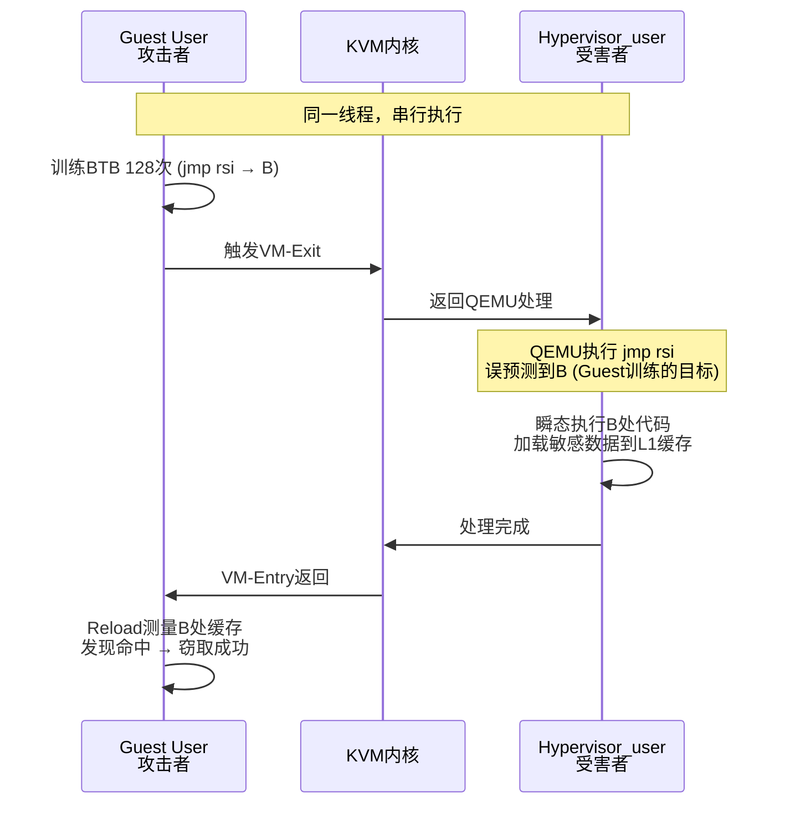
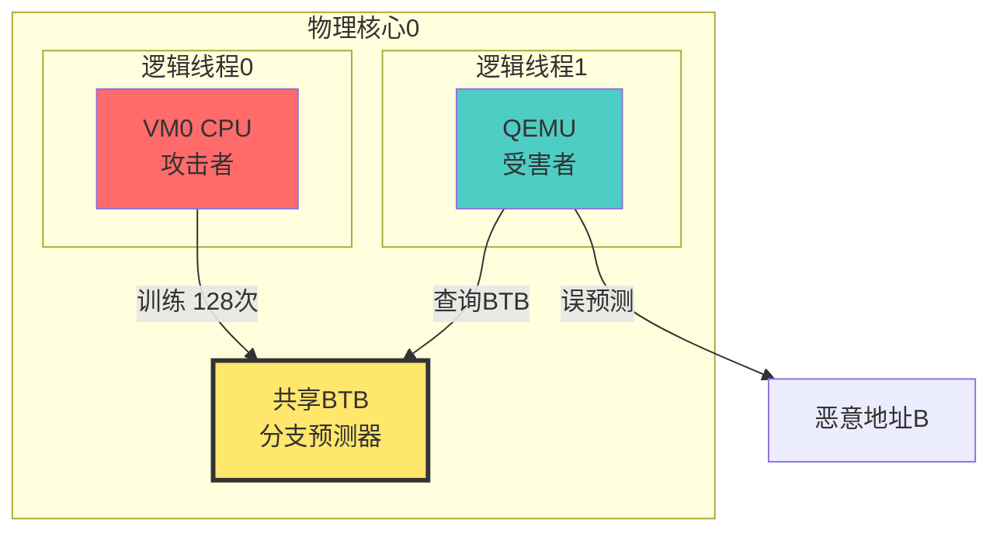

# 1. 注：Hypervisor_user是什么？

## Hypervisor_user 权限级别与区别

| 概念                | 运行位置          | 权限                   | 角色                           |
| ------------------- | ----------------- | ---------------------- | ------------------------------ |
| **Hypervisor_user** | **Host User空间** | **特权**（可管理VM）   | **酒店前台**（能开房门）       |
| **Host User**       | Host User空间     | 普通（只能访问Host）   | **酒店住客**（只能进自己屋）   |
| **Guest User**      | Guest User空间    | 虚拟受限（只能访问VM） | **客房住客**（只能进自己房间） |

**核心区别**：Hypervisor_user是**Host上的"特权用户"**，专门管理虚拟机，权限 > 普通Host User，而Guest User是**被隔离的"虚拟住客"**，权限最低。

---

# 2. G→H | Hypervisor_user 攻击场景

这是**虚拟化环境中最危险的侧信道攻击之一**。我将用"酒店窃听"故事逐步拆解。

---

## 一、前置知识：四个关键概念（必须懂）

### **1. Guest（客户机）= 酒店房间**
- 你在云服务器上租的虚拟机（VM）
- 以为自己独占一台电脑，实际是"虚拟房间"

### **2. Hypervisor_user（监控器的用户态）= 酒店前台软件**
- KVM不是只有内核模块，还有用户态程序（如**QEMU**）
- 负责模拟虚拟硬件（网卡、磁盘等）
- 运行在**Host的用户空间**（酒店经理的电脑）

### **3. BTB（分支目标缓冲区）= 导航记忆**
- CPU的一个高速缓存，记录"上次跳转到哪"
- 像导航App的"历史记录"，加快分支跳转速度
- **核心漏洞**：VM-Exit时**不清空**这个记忆

### **4. SMT（同时多线程）= 双人办公室**
- 一个物理核心模拟两个逻辑线程（超线程）
- 两个线程**共享BTB、L1缓存**等资源
- **致命风险**：攻击者和受害者被迫"共处一室"

---

## 二、攻击场景：同酒店房间内的间谍战

### **攻击模型 G→H | Hypervisor_user **

| 角色       | 实体                 | 任务                          |
| ---------- | -------------------- | ----------------------------- |
| **攻击者** | **Guest User（你）** | 在VM0中运行恶意代码           |
| **受害者** | **Hypervisor_user**  | QEMU进程（处理VM0的硬件请求） |
| **攻击面** | **共享BTB**          | VM-Exit时未清理的分支预测状态 |

**类比**：

- 你是酒店房间A的住客（攻击者）
- 前台服务员（QEMU）为你服务（受害者）
- 你们共用同一个写字台的便签（BTB）
- 你在便签上写"请跳转201房间"（训练）
- 服务员处理房间B请求时，看到便签误跳到201（攻击成功）

---

## 三、攻击原理：VM-Exit时的"记忆残留"

### ** 3.1 正常流程：VM-Exit应该清理BTB **

```c
// VM0执行敏感指令 → 触发VM-Exit
VM0 (Guest User): wrmsr 0xC0010113  // 试图读取VM-Exit计数
    ↓
CPU硬件: 检测到特权指令 → 保存VM0状态 → 切换到Host
    ↓
KVM内核: 处理wrmsr → 拒绝访问 → 准备返回VM0
    ↓
**理想情况**: KVM应清空BTB，防止VM0污染影响Host
    ↓
QEMU (Hypervisor_user): 继续运行
```

### ** 3.2 漏洞现实：BTB未清理 **

```c
// VM0在VM-Exit前执行的代码（攻击训练）
VM0: 
    for (int i = 0; i < 128; i++) {
        // 训练BTB：jmp rsi → 跳转到地址B
        asm("jmp *%rsi");  // rsi = B (恶意地址)
    }
    // BTB已建立"rsi=B"的强预测
    ↓
VM-Exit触发
    ↓
KVM: **未清空BTB！** (漏洞所在)
    ↓
QEMU (Hypervisor_user) 开始处理VM-Exit
    ↓
QEMU执行自己的代码:
    if (need_emulation) {
        // QEMU内部也有 jmp rsi 指令
        // CPU看到BTB残留："上次rsi=B，这次也跳B"
        // **瞬态执行**：QEMU误跳到地址B（恶意代码）
        // **泄露**：QEMU在地址B加载的数据被VM0测量到
    }
```

** 核心漏洞 **：** VM-Entry/Exit 不清空BTB **，导致Guest可以"训练"Host的分支预测器。

---

## 四、两种攻击变体：Same-Thread vs Cross-SMT

### ** 4.1 Same-Thread攻击（单核串行） **

** 场景 **：VM0和QEMU** 在同一个逻辑线程上串行执行 **（VM-Exit→KVM→QEMU→VM-Entry）



** 为什么成功率只有30-40%？ **
- ** 时间窗口 **：VM-Exit处理完后，QEMU的BTB状态可能被其他Host进程污染
- ** 无强制共存 **：QEMU可能切换到其他线程执行

---

### ** 4.2 Cross-SMT攻击（超线程并行） **

** 场景 **：VM0运行** 线程0**，QEMU运行**线程1**，**共享同一物理核心**的BTB



**为何成功率高达90-95%？**

- **强制共存**：操作系统调度器可能将VM0和QEMU分配到**同一物理核心的两个线程**（云服务常见优化）
- **实时污染**：VM0每次训练，QEMU的BTB状态**立即更新**（无时间窗口）
- **共享无刷新**：SMT不触发VM-Exit，BTB状态**长期保留**

**调度器失效**：
```c
// 正常情况下，调度器会避免将攻击者和受害者放一起
// 但此处受害者是QEMU（Guest的必要组件），必须和VM0共存
// 攻击者VM0 ←必定→ QEMU（处理VM0的硬件请求）
// 因此跨SMT攻击几乎是"必然发生"
```

---

## 五、攻击优势：为何比 G→H | Host Process 更简单？

### **对比：G→H | Host Process（传统跨VM攻击）**

| 攻击类型            | 受害者                        | 攻击前提                             | 难度          |
| ------------------- | ----------------------------- | ------------------------------------ | ------------- |
| **Host Process**    | Host上的其他进程（如sshd）    | 需与受害者进程**同一CPU核心**        | ⭐⭐⭐（调度难） |
| **Hypervisor_user** | QEMU（Guest自己的Hypervisor） | **必须处理VM0的VM-Exit**（强制共存） | ⭐（必然共存） |

**具体优势**：

1. **强制交互**：VM0每次触发VM-Exit，QEMU必须响应。攻击者可**故意频繁触发**（如循环执行`rdmsr`）→ **100%保证QEMU执行**
2. **无需寻找受害者**：受害者就是**服务你的QEMU**，位置已知
3. **跨SMT更实用**：调度器无法将QEMU和VM0分开（否则VM无法运行）

---

## 六、攻击目标：能窃取什么敏感数据？

### **6.1 QEMU内存中的秘密**

QEMU为模拟硬件，需加载**云基础设施密钥**：

```c
// QEMU地址空间中的典型敏感数据
// 1. 虚拟网卡配置（包含VPC密钥）
struct virtio_net_config {
    uint8_t mac[6];
    uint32_t cloud_vpc_key;  // 网络隔离密钥
};

// 2. 虚拟磁盘加密密钥
struct virtio_blk_crypto_key {
    uint8_t key[32];  // LUKS加密密钥
};

// 3. VM迁移密钥（vMotion）
struct migration_state {
    uint8_t tls_key[48];  // TLS传输密钥
};
```

### **6.2 攻击效果**

**通过BTB污染+瞬态执行**，攻击者可让QEMU误加载上述密钥到缓存，然后用**Flush+Reload**测量：

- **恢复VPC密钥**：可伪造同一网络的其他VM流量
- **恢复磁盘密钥**：解密VM1的虚拟硬盘
- **恢复迁移密钥**：窃取迁移过程中的内存快照

---

## 七、受影响的CPU范围

| CPU型号         | 同线程攻击 | 跨SMT攻击 | 原因                       |
| --------------- | ---------- | --------- | -------------------------- |
| **Zen 1**       | ✅ 脆弱     | ✅ 脆弱    | 无BTB隔离，无IBPB          |
| **Zen 2**       | ✅ 脆弱     | ❌ 安全    | 引入部分BTB隔离            |
| **Zen 3**       | ✅ 脆弱     | ❌ 安全    | 强BTB隔离，但VM-Exit不清理 |
| **Zen 4/5**     | ✅ 脆弱     | ❌ 安全    | 同Zen3                     |
| **Coffee Lake** | ✅ 脆弱     | ✅ 脆弱    | Intel BTB隔离更差          |

**AMD Zen 3为何脆弱？**
- **VM-Exit/Entry**：**不刷新BTB**（性能考虑）
- **IBPB**：**无硬件支持**（Intel有）
- **缓解**：依赖`lfence`，但QEMU编译时可能未启用

---

## 八、观察05的核心结论

> **Cross-SMT G→H | Hypervisor_user 攻击更容易发生，因为攻击者和受害者属于同一个Guest执行，使得共存更有可能。**

**白话翻译**：
- 传统跨SMT攻击：攻击者（VM0）和受害者（VM1）是两个房间，酒店调度员可能不把他们放隔壁
- 本攻击：攻击者（VM0）和受害者（QEMU）是**房间和专职服务员**，必定配对在一起 → **100%共存**

**云计算影响**：
- **阿里云/AWS**：若未禁用SMT，攻击者VM可轻易窃取同一物理机其他VM的QEMU密钥
- **防御**：需配置`kvm-amd.nosmt=1`，但性能损耗15%

---

## 九、完整攻击故事

**角色**：
- **你（攻击者）**：住在酒店房间A（VM0）
- **服务员（QEMU）**：专门为你服务的前台
- **便签（BTB）**：服务员和你共用的小本子

**攻击步骤**：
1. **训练**：你在便签上写128遍"去201房"（让BTB记住rsi→B）
2. **触发**：你按铃叫服务员（VM-Exit）
3. **污染**：服务员来看便签，看到"去201房"的记忆残留
4. **误跳**：服务员处理其他请求时，误跳到201房（瞬态执行）
5. **窃取**：201房里有云平台的密钥，被加载到缓存
6. **测量**：你测量201房的访问时间，发现很快 → 密钥到手！

**跨SMT**：你和服务员在同一办公室（同一物理核心），共用同一个便签，攻击更容易。

---

## 十、毕设如何研究这个？

### **实验设计建议**

**阶段1：复现Same-Thread攻击**
```c
// 在单个VM中模拟G→H | Hypervisor_user
// 用ioctl(KVM_RUN)手动触发VM-Exit
void test_same_thread() {
    // 1. 训练BTB (128次jmp rsi → B)
    // 2. ioctl(KVM_RUN) → QEMU处理
    // 3. 测量QEMU是否误跳到B
    // 预期成功率：30-40%
}
```

**阶段2：复现Cross-SMT攻击**
```bash
# 1. 启用SMT
echo on > /sys/devices/system/cpu/smt/control

# 2. 绑定VM0的vCPU和QEMU到同一物理核心的两个线程
taskset -c 0,1 qemu-system-x86_64 ... vm0.img &
taskset -c 0,1 qemu-system-x86_64 ... vm1.img &

# 3. 在VM0中运行攻击代码
# 预期成功率：>90%
```

**阶段3：量化缓解措施**
```bash
# 测试nosmt效果
echo off > /sys/devices/system/cpu/smt/control
# 重新测试，成功率应降至<5%
```

**交付物**：
- **数据表格**：Zen3在Same-Thread和Cross-SMT下的攻击成功率
- **热力图**：展示攻击者与受害者在不同核心配置下的BTB污染程度
- **缓解报告**：nosmt/IBPB/微码更新的效果对比

---

## 十一、一句话总结

**G→H | Hypervisor_user** 攻击就是：**利用VM-Exit不清空BTB的漏洞，让虚拟机里的恶意代码"教坏"虚拟机监控器，使其在处理硬件请求时跳转到错误地址，泄露云平台的底层密钥。**