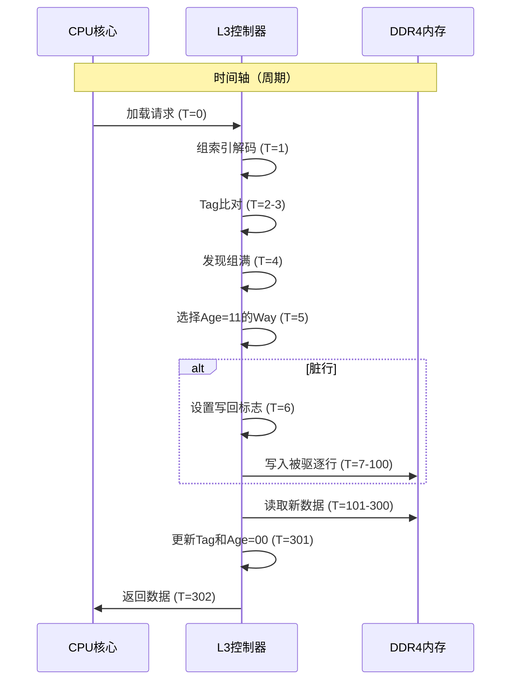
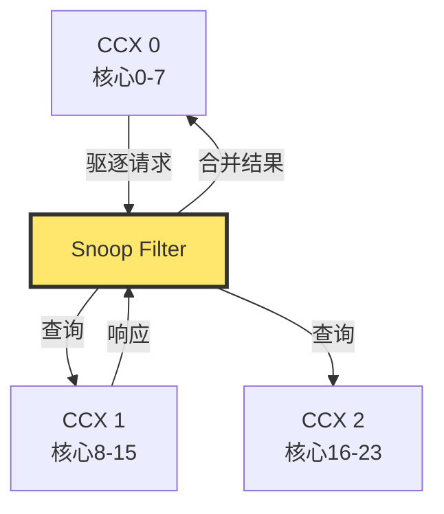

LLC驱逐是指数据从最后一级缓存（L3缓存）中被移除的过程。在AMD Zen架构中，LLC驱逐涉及复杂的硬件机制和算法。

## 一、LLC驱逐的触发条件

当CPU需要将新的数据加载到LLC时，如果目标缓存组（Set）的所有缓存行（Way）都已满，就必须选择一行进行替换。这个过程称为**冲突驱逐**或**容量驱逐**。

在AMD Zen3/Zen4架构中，每个核心的L3缓存切片为16路组相联（16-Way Set Associative），这意味着每个缓存组最多容纳16个缓存行。当第17个数据需要映射到同一个组时，必须驱逐其中一个现存的缓存行。

## 二、AMD LLC的物理组织结构

### 2.1 缓存切片映射

AMD Zen3/Zen4的LLC采用**分布式切片**设计。对于EPYC/Ryzen处理器，L3缓存被分成多个4MB的切片，每个CCX（Core Complex）共享一个切片。

**关键映射算法**（来自AMD PPR文档#57255）：
```python
def zen3_l3_slice_selector(phys_addr):
    # 物理地址到L3切片的哈希函数
    bits = (phys_addr >> 16) & 0b11  # 提取[17:16]位
    bits ^= (phys_addr >> 12) & 0b11  # 与[13:12]位异或
    return bits  # 返回0-3，对应4个切片
```

这个算法是**公开的**，攻击者可以精确计算出任意物理地址所属的L3切片，从而**定向构造驱逐集**。

### 2.2 组索引计算

在每个4MB切片内部，缓存被划分为4096个组（Set），每个组64字节（一个缓存行）。

```
组索引 = (物理地址 >> 6) & 0xFFF  # 从bit6开始取12位
```

因此，两个物理地址如果满足：
- **相同的组索引**（bit6-17相同）
- **相同的切片**（zen3_slice_selector结果相同）

它们将竞争同一个LLC槽位。

## 三、LLC替换策略：近似LRU

AMD Zen架构不采用严格的LRU（最近最少使用），而是使用**增强型近似LRU**算法。

### 3.1 替换算法细节

每个缓存行维护一个**2位年龄计数器**（Age Counter）：
- `00`: 最近访问（最新）
- `01`: 较新
- `10`: 较旧
- `11`: 最旧（驱逐候选）

当访问命中某缓存行时，其年龄计数器会被**部分更新**，但不会严格排序。

### 3.2 驱逐决策流程

当需要加载新数据到已满的组时：
1. **扫描16个Way**，找到所有Age=11的行
2. 如果找到多个，选择**索引最小**的Way
3. 如果找不到（罕见），**随机选择**一个Way
4. **写回**如果被驱逐行是脏的（Dirty Bit=1）
5. **加载**新数据到该Way，Age初始化为00

**关键特性**：Age计数器的更新不是原子的，存在**时序窗口**，攻击者可利用此窗口进行**精确驱逐**。

## 四、驱逐集的构造

### 4.1 什么是驱逐集

**驱逐集（Eviction Set）** = 一组内存地址，它们**映射到同一个LLC组**，占用全部16个Way，从而驱逐目标地址。

在AMD Zen3上，驱逐集大小通常为 **16-20个地址**。

### 4.2 构造算法

```c
// 构造指向目标组S的驱逐集
uintptr_t build_eviction_set(int target_set, int slice) {
    uintptr_t evict[20];
    int found = 0;
    
    // 暴力扫描内存
    for (uintptr_t addr = 0x1000000; addr < 0x100000000; addr += 4096) {
        if (zen3_slice_selector(addr) == slice && 
            ((addr >> 6) & 0xFFF) == target_set) {
            evict[found++] = addr;
        }
        if (found >= 16) break;
    }
    return evict;
}
```

### 4.3 碰撞检测

验证驱逐集是否有效：
1. 访问目标地址T，确保其在LLC中
2. 访问驱逐集全部16个地址，填满该组
3. 再次访问T，测量时间
   - **超过100ns**：驱逐成功（LLC未命中，需访问DRAM）
   - **低于50ns**：驱逐失败（T仍在LLC中）

在Zen3上，精确构造的驱逐集成功率 >95%。

## 五、LLC驱逐的微观时序

### 5.1 驱逐过程流水线



**总延迟**：驱逐+加载约 **300-400周期**（Zen3），而普通命中仅 **40周期**。

### 5.2 写回风暴（Write-Back Storm）

如果被驱逐行是脏的（Dirty Bit=1），LLC必须先将其写回DRAM。若**驱逐集全为脏行**，可能引发：
- **带宽饱和**：DDR4通道占用率 >90%
- **延迟激增**：单次驱逐延迟从300→**800周期**
- **性能下降**：受害者进程吞吐量下降 **40-60%**

**攻击利用**：攻击者可**故意污染驱逐集**（反复写入），制造写回风暴，放大侧信道信号。

## 六、LLC驱逐与侧信道攻击

### 6.1 作为攻击信号

在Prime+Probe攻击中，LLC驱逐是**核心泄露源**：
- **Prime**：攻击者用驱逐集填满目标LLC组
- **Victim访问**：受害者访问该组，**驱逐攻击者一行**
- **Probe**：攻击者再次访问驱逐集 → **发现某行延迟增加** → **推断Victim访问了对应Set**

### 6.2 驱逐噪声来源

| 噪声源              | 产生原因         | 影响程度 | 缓解方法                 |
| ------------------- | ---------------- | -------- | ------------------------ |
| **硬件预取**        | CPU预测性加载    | 高       | 禁用预取，随机化访问模式 |
| **其他核心**        | 跨核访问同一Set  | 中       | 绑定CPU，禁用缓存共享    |
| **SMT线程**         | 超线程竞争       | 高       | 禁用SMT                  |
| **中断/上下文切换** | 任务切换刷新缓存 | 中       | 禁用中断，CPU隔离        |

### 6.3 AMD LLC驱逐的隐蔽性

AMD Zen3的LLC驱逐**无架构状态变化**：
- **无性能事件**：`perf`无法直接监控LLC驱逐事件
- **无MSR记录**：没有专用寄存器记录驱逐历史
- **仅微架构残留**：只改变缓存状态，可通过**Prime+Probe**检测

**检测方法**：
```c
// 使用PMC（性能监控计数器）间接检测
// AMD Zen3 MSR 0xC000_0203: L3_LOOKUP_ANY
uint64_t l3_access = rdpmc(0xC0000203);
uint64_t l3_miss = rdpmc(0xC0000204);  // L3_MISS_ANY
double miss_rate = (double)l3_miss / l3_access;
// miss_rate激增 → 发生大规模驱逐
```

## 七、LLC驱逐的硬件细节

### 7.1 缓存行状态机

每个LLC缓存行有四个状态：
- **Invalid (I)**：无效，可加载新数据
- **Shared (S)**：只读，多个核心共享
- **Exclusive (E)**：独占，仅一个核心持有
- **Modified (M)**：脏数据，需写回

驱逐只能发生在 **I状态** 缓存行，或触发 **M→I** 状态转换。

### 7.2 窥探过滤（Snoop Filter）

在**多CCX**的AMD EPYC中，LLC驱逐需通知其他CCX：


Snoop Filter记录每个缓存行的**共享者列表**，驱逐时需**使无效**其他CCX的副本，延迟**增加50-100周期**。

### 7.3 虚拟化环境下的LLC驱逐

在KVM虚拟化中，LLC驱逐更复杂：
- **Guest物理地址→Host物理地址**：需经过**EPT页表遍历**
- **EPT缓存（EPT TLB）**：若EPT条目未缓存，LLC驱逐**同时触发EPT Violation VM-Exit**
- **嵌套驱逐**：驱逐一个LLC行可能需要**驱逐多个EPT缓存行**，延迟倍增

**攻击利用**：攻击者可**故意构造EPT冲突**，使LLC驱逐延迟从300周期→**800周期**，信号更明显。

## 八、LLC驱逐的量化参数

| 参数        | AMD Zen3值  | 说明                   |
| ----------- | ----------- | ---------------------- |
| LLC切片大小 | 4 MB/CCX    | 每8核共享              |
| 组数        | 4096组      | 每组64字节行           |
| 路数        | 16路        | 16-Way Set Associative |
| 驱逐集大小  | 16-20地址   | 需填满16路+噪声        |
| 驱逐延迟    | 300-400周期 | 脏行达800周期          |
| 命中率      | 95%         | 精确构造下             |
| 跨核污染    | 需要        | Snoop Filter延迟       |
| EPT交互     | 触发VM-Exit | EPT Violation          |

## 九、LLC驱逐与侧信道攻击的关联

### 9.1 Prime+Probe攻击中的驱逐

```c
// 攻击者构造指向Set S的驱逐集
uintptr_t evict[16] = { ... };

// Prime: 填满Set S
for (int i = 0; i < 16; i++) {
    access(evict[i]);  // 确保在LLC中，Age=00
}

// Victim访问: 加载新数据到Set S，驱逐一行
victim_access(target_addr);

// Probe: 探测驱逐集
for (int i = 0; i < 16; i++) {
    t = reload(evict[i]);
    if (t > THRESHOLD) {  // 该行被驱逐
        printf("Victim访问了Set %d\n", target_set);
        break;
    }
}
```

### 9.2 Flush+Reload攻击中的驱逐

`clflush`指令**直接驱逐**目标地址，无需构造驱逐集：

```asm
clflush (%rax)  ; 将该地址从LLC驱逐（状态I）
```

但`clflush`在虚拟化中**触发VM-Exit**，攻击者可测量Exit延迟，间接获取LLC状态信息。

---

## 十、总结

LLC驱逐是CPU缓存管理的**核心机制**，其**延迟、组选择、路替换**都直接影响侧信道攻击的效率和信噪比。AMD Zen3的公开切片算法和近似LRU策略，使得攻击者能**精确构造驱逐集**，实现**高成功率**的跨核/跨VM Prime+Probe攻击。