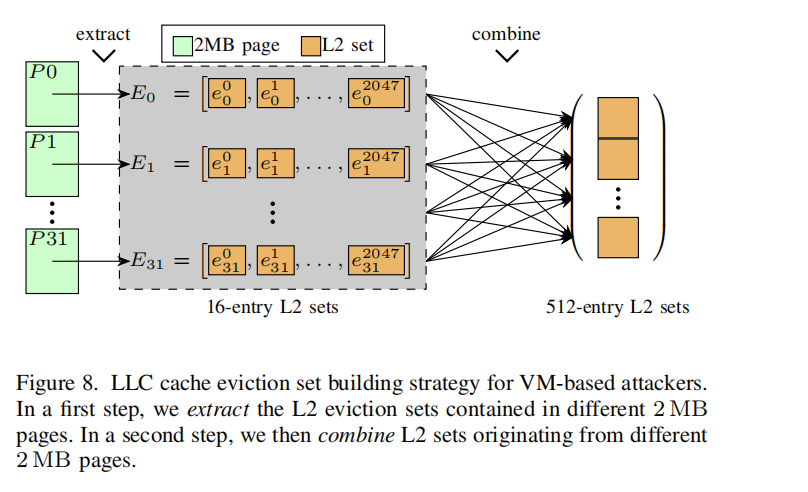

# 图8：VM攻击者构建LLC驱逐集策略

---

## 核心思想：两步走，绕过VM内存限制

**VM攻击者无法直接控制物理页**，只能使用2MB大页。图8展示如何利用大页特性构建LLC驱逐集：

```
┌───────────────┐      ┌───────────────┐
│  第一步：提取  │  →   │  第二步：组合  │
│  单大页L2集   │      │  跨大页LLC集   │
└───────────────┘      └───────────────┘
      ↓                      ↓
   2047个地址           31个大页×4组
```

---

## 第一步：Extract（提取）

**在单个2MB大页内**：地址连续，只能覆盖L2缓存的**4个组**

- **L2驱逐集大小**：**2047个地址** = 4组 × (16路 - 1)
- **提取方法**：按4KB步长遍历大页，找到映射到同一L2组的地址

**为什么2047？**  
填满4个L2组，每组16路，留1个空位给目标地址。

---

## 第二步：Combine（组合）

**跨31个不同2MB大页**：每个大页提供4个L2组

- **总数**：31页 × 4组/页 = **124个L2组**
- **目标**：这些L2组共同映射到**同一个LLC组**（LLC有4096组）

**关键数字：31**  
理论最小值，确保能填满LLC的16个路（实际需冗余地址）。

---

## 为什么这是"VM攻击者策略"？

| 角色           | 内存控制            | 策略必要性                       |
| -------------- | ------------------- | -------------------------------- |
| **普通攻击者** | 可分配任意4KB页     | 无需此策略，直接构造16个地址即可 |
| **VM攻击者**   | **只能使用2MB大页** | 必须从大页提取L2集再组合         |

**VM的困境**：

- 无法跨大页连续分配地址
- 2MB页内地址模式受限
- **只能通过"组合"绕过限制**

---

## 总结

**图8的核心**：VM攻击者通过 **"单页提取L2集，跨页组合LLC集"** ，在只能使用大页的限制下，精确构造出跨VM的LLC驱逐集，实现Prime+Probe攻击。

**效果**：可在AWS/阿里云等公有云中，窃取同物理机其他VM的缓存数据。

---