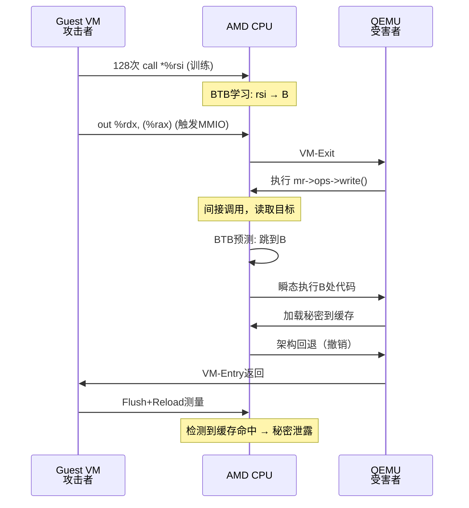

# 推测装置（Speculation Gadget）详解：QEMU的MMIO Write Handler

---

## 一、这行代码就是"推测装置"

```c
// QEMU源代码：system/memory.c 第12行
mr->ops->write(mr->opaque, addr, tmp, size);
```

**本质**：这是一个**间接调用（函数指针调用）**，正是推测执行攻击的完美目标。

---

## 二、为什么这行代码是"受害者分支"？

### **特征1：间接调用（Indirect Call）**
- `mr->ops->write` 是一个**函数指针**
- CPU执行前需要先**读取指针值**，再跳转
- **分支预测器**会猜测跳转到哪，猜错就触发**推测执行**

### **特征2：攻击者可控寄存器**
- **tmp**：MMIO写入的值，**攻击者完全控制**（通过`MMIO_WRITE`指令）
- **addr**：MMIO地址，部分可控
- **mr->opaque**：设备状态，不可控但可预测

**攻击者优势**：能控制间接调用的**参数**，进而影响推测执行时的**数据流**

---

## 三、攻击者如何控制这个Gadget？

### **控制路径：MMIO写入**

1. **Guest VM执行**：
   ```c
   // Guest代码
   mov $0x12345678, %rdx    // 恶意地址
   mov $0xDEADBEEF, %rax    // MMIO端口
   out %rdx, (%rax)         // 写入MMIO
   ```

2. **QEMU接收**：
   - `%rdx`的值 → `tmp`变量
   - `%rax`的值 → `addr`变量
   - 触发`memory_region_write_accessor()`

3. **间接调用**：
   ```c
   mr->ops->write(mr->opaque, addr, tmp, size);
   //                    ↑               ↑
   //                部分可控       完全可控（攻击者的恶意地址）
   ```

### **观察O12：MMIO提供完美交互**
- **可重复**：Guest可无限次写入MMIO
- **可靠**：QEMU必定处理，无失败路径
- **高频**：每秒可触发数百万次VM-Exit

---

## 四、推测执行如何泄露秘密？

### **步骤1：训练BTB（Branch Target Buffer）**

Guest在VM-Exit前执行：
```c
// 训练循环 128次
for (i=0; i<128; i++) {
    // 间接调用，目标地址 = 恶意地址B
    call *%rsi   // rsi = B (攻击者控制)
}
// BTB被训练：下次看到间接调用，预测跳到B
```

### **步骤2：触发Victim Branch**

Guest再次MMIO写入：
```c
out %rdx, (%rax)  // rdx = 恶意地址B
```

QEMU处理：
```c
mr->ops->write(..., tmp=B);  // 间接调用，目标地址 = B
```

CPU推测：根据BTB历史，**预测跳到B**

### **步骤3：推测执行泄露**

即使QEMU最终发现不应跳B（架构层面回退），但瞬态执行已发生：
```c
// 推测执行时（CPU误跳B）
B:
    mov (RAX), RBX  // RAX含秘密指针，加载秘密到缓存
```

### **步骤4：Guest测量**

Guest用FLUSH+RELOAD测量：
```c
clflush(secret_cache_line);  // 驱逐
wait();                       // 等待推测执行
reload(secret_cache_line);    // 测量时间
// 时间短 → 推测执行加载了秘密 → 窃取成功
```

---

## 五、Gadget的硬件级执行流程



---

## 六、总结：这个Gadget的优点

| 特性         | 说明                   | 对攻击的价值 |
| ------------ | ---------------------- | ------------ |
| **间接调用** | `mr->ops->write`是指针 | 触发推测执行 |
| **参数可控** | `tmp` = Guest写入值    | 控制跳转目标 |
| **高频触发** | MMIO可无限次写入       | 快速训练BTB  |
| **可靠执行** | QEMU必定处理MMIO       | 无失败路径   |
| **代码小**   | 仅一行代码             | 易于定位     |

**一句话**：这行代码是**QEMU的"阿喀琉斯之踵"**——既必须执行，又间接调用，还给攻击者控制权，完美符合推测攻击的所有条件。

---

**这就是VMSCAPE攻击的核心Gadget，所有后续步骤（ASLR破解、LLC驱逐、密钥泄露）都围绕它展开。**