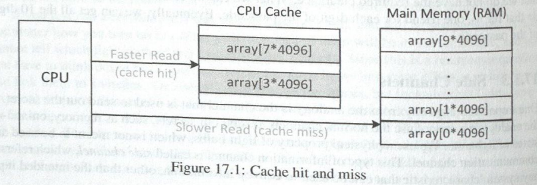
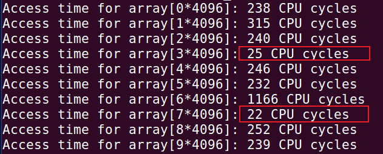
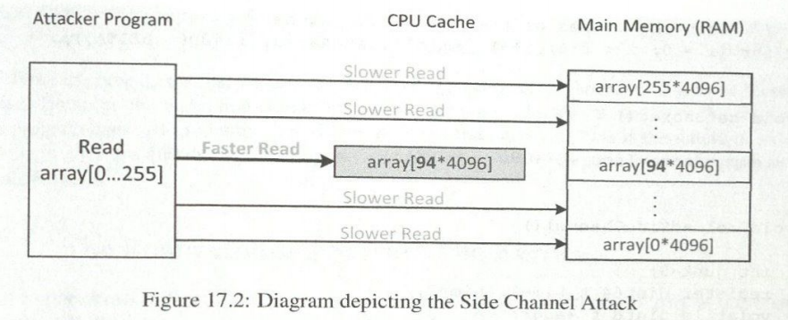
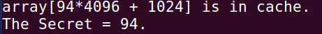
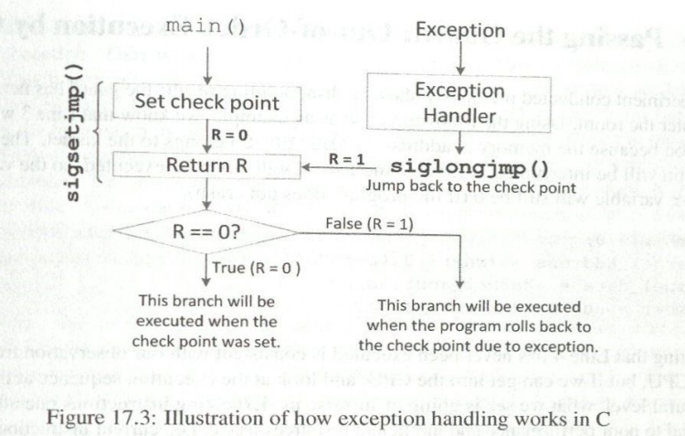
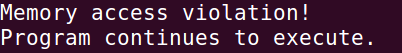
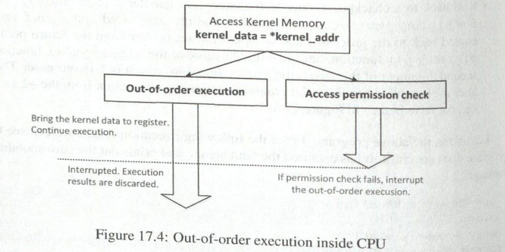
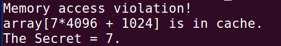
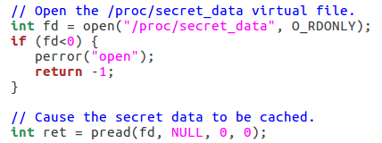
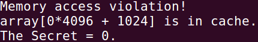

## 1. 配置

#### 1.1 物理机：

处理器型号：`i5-1135G7`

代数：第 11 代（11th Gen）

系统型号：Vostro 3400

架构：Tiger Lake

#### 1.2 虚拟机：

SEED - Ubuntu16.04 - 32bit 

1核心 2GB内存 

CPU模拟： Intel Core i7-5600U（第5代 Broadwell）

## 2. 实验流程

#### 2.1 CacheTime.c 测访问缓存与内存的时间差



```shell
$ gcc -march=native CacheTime.c
$ a.out
```

**运行结果：**



明显看到数组[3**4096]和数组[7*4096]的访问速度始终快于其他元素，这是因为第3个和第7个元素已被缓存，而其他元素尚未被缓存。

#### 2.2 FlushReload.c **利用**CPU缓存作为侧信道



```shell
$ gcc -march=native FlushReload.c
$ a.out
```

**运行结果：**



#### 2.3 MeltdownKernel.c 编译与运行

通过Makefile来编译内核模块。编译完成后，将生成名为MeltdownKernel.ko的文件。使用insmod命令安装内核模块。成功安装后，可通过dmesg命令从内核消息缓冲区获取密钥数据地址，并将该地址记录下来以备后续使用。

```shell
$ make
$ sudo insmod MeltdownKernel.ko
$ dmesg | grep 'secret data address'
```

注：

```shell
// 内核重新编译加载
make clean
make
sudo rmmod MeltdownKernel
sudo insmod MeltdownKernel.ko
```

**运行结果：**


#### 2.4 Guard：验证不能直接访问内核内存

创建文件GuardPreventAccess.c 

```c
#include <stdio.h>
int main() 
{
  char *kernel_data_addr = (char*)0xf93ed000;
  char kernel_data = *kernel_data_addr;
  printf("I have reached here.\n");
  return 0;
}
```

```shell
$ gcc -march=native GuardPreventAccess.c 
$ a.out
```

**运行结果：**


直接访问内核内存发生Segmentation fault

#### 2.5 ExceptionHandling.c 当程序遇到内存访问错误等严重异常时，通过异常处理机制确保程序能够继续正常运行。



```shell
$ gcc ExceptionHandling.c
$ a.out
```

**运行结果：**



#### 2.6 MeltdownExperiment.c 越过Guard：CPU的乱序执行



```shell
$ gcc -march=native MeltdownExperiment.c
$ a.out
```

**运行结果：**



#### 2.7 The Meltdown Attack


```shell
$ gcc -march=native MeltdownExperiment.c
$ a.out
```

**运行结果：**


攻击失败!

#### 2.8 提升乱序执行的效率

Meltdown漏洞属于竞态条件漏洞，其核心在于乱序执行与访问检查之间的竞速。乱序执行速度越快，可执行的指令就越多，从而更容易产生可观测效应，进而帮助我们获取秘密。

**解决方案:** 在攻击启动前缓存内核机密数据。让用户级程序调用内核模块内部的函数，该函数将访问机密数据而不向用户级程序泄露信息，但机密数据会存在于CPU缓存中。



```shell
$ gcc -march=native MeltdownExperiment.c
$ a.out
```

**运行结果：**



攻击失败！

#### 2.9 meltdown_asm() 用汇编代码改进攻击

```shell
$ gcc -march=native MeltdownExperiment.c
$ a.out
```

攻击失败？？？？ 未成功复现

原因：


#### 2.10 MeltdownAttack.c 用统计方法改进攻击

```shell
$ gcc -march=native MeltdownAttack.c
$ a.out
```

攻击失败？？？？ 未成功复现

原因：