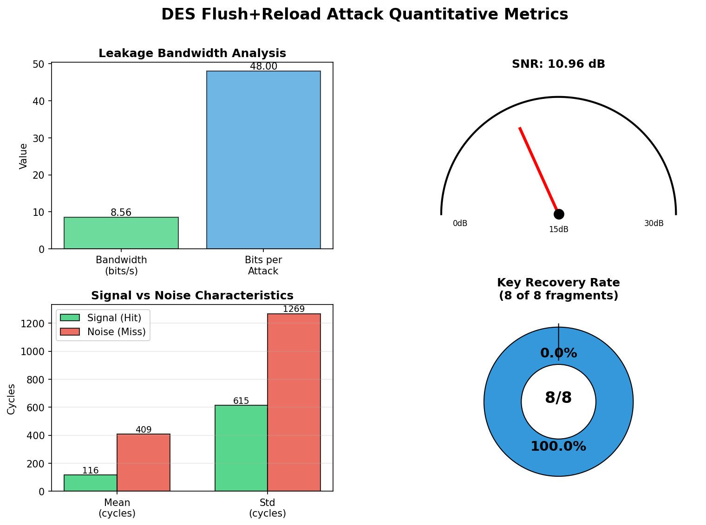

```shell
编译
$ make clean && make

运行 spy 程序（需要 sudo 权限进行缓存操作）
$ sudo ./build/spy ./build/libdes.so

首次使用前安装依赖（不需要 sudo）
$ pip3 install -r requirements.txt

运行可视化脚本（不需要 sudo）
$ python3 ./src/tools/quantify_analysis.py
```

运行结果：

**quantitative_metrics.png**



