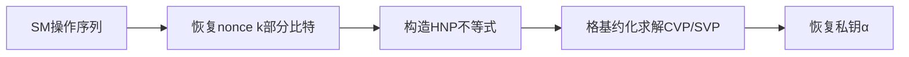
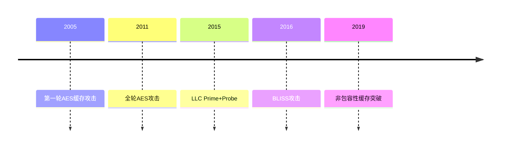
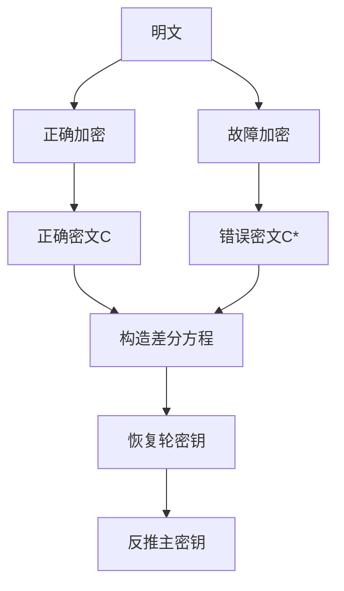
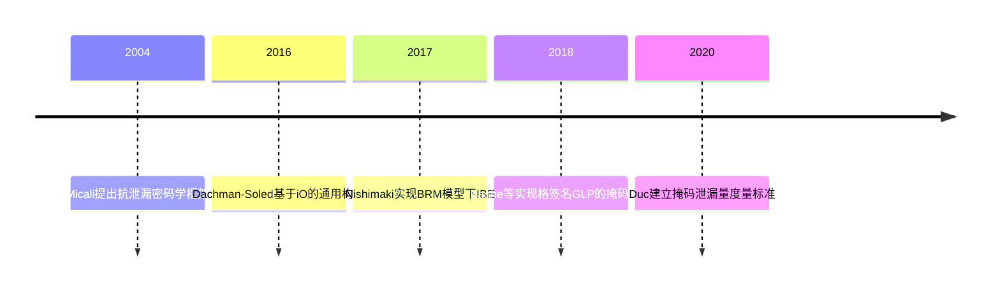

## 《侧信道攻击与防御技术研究进展》

**论文链接：**http://cjc.ict.ac.cn/online/onlinepaper/wyj-2023112143101.pdf 

**摘要：**侧信道攻击利用密码实现的**物理泄露**而不是理论弱点来恢复密钥，对密码系统的安全实现有严重的现实威胁. 密码设备运行时所产生的**能量、电磁、缓存和故障输出等侧信息均可能导致密钥信息泄漏**，攻击者通过分析侧信息中与密钥相关的特征点来获取密钥信息. 为了应对侧信道攻击，侧信道防御技术和抗泄漏密码学也成为研究的热点问题. 前者的总体思路在于消除侧信息泄漏或者消除秘密信息与所泄漏侧信息之间的相关性，而后者旨在准确量化密码系统执行过程中的侧信息泄漏，进而构造具有抗泄漏安全性的密码方案. 本文系统地介绍了侧信道攻击与防御技术发展：首先，剖析了**时序攻击、能量分析攻击、缓存攻击和故障攻击的基本原理、攻击方法、应用场景和发展现状，并提炼出每一类攻击的通用模型**；其次，概括出侧信道防御技术的本质特征，并分析了**侧信道防御技术的基本原理、安全模型和应用场景；**之后总结了抗泄漏密码学的基本原理与发展现状，梳理了**典型的抗泄漏密码方案**；最后分析了现有研究工作中存在的问题，并对未来的研究方向进行了展望.

**关键词** ：侧信道攻击；侧信道防御；抗泄漏密码学；能量分析攻击；缓存攻击；故障攻击

---

## 一. 侧信道攻击

### 1.  时序攻击

```cpp
平方乘算法
输入：基数 b，模数 m，指数 e = (e_{n-1}···e_0)
输出：b^e mod m

r = 1  // 初始化结果变量  
for i = n-1 downto 0 do  // 遍历指数二进制位（从最高位到最低位）  
   // 【时序攻击泄漏点1】：循环次数 = 指数二进制位数，暴露密钥长度信息 
    if e_i = 1 then  // 若当前位为1，执行乘法操作  
    // 【时序攻击泄漏点2】：条件分支导致执行路径差异，是密钥位信息泄漏的核心
    // 攻击利用：乘法操作（第4行）比单纯平方操作耗时更长，攻击者可通过测量时间差推断e_i是否为1  
        r = r · b mod m  // 乘法步骤：密钥相关操作，时序泄漏关键节点  
    end if  
    r = r² mod m  // 平方操作：无论e_i是否为1均执行，耗时相对稳定  
    // 攻击案例：Brumley等人利用Montgomery模约化步骤的额外模简化时间差，攻击OpenSSL的RSA实现
end for  
return r  // 输出模幂结果
```

**1.1 泄漏点**：

- 第2行循环次数直接对应指数 e e e 的二进制位数，攻击者可通过多次测量推断密钥长度（如RSA密钥的2048位/4096位）。
- 第3-5行的条件分支（`if e_i=1`）导致乘法操作（第4行）的执行次数与密钥位中1的数量正相关，执行时间差异可被精确测量（如本地网络环境下，Billy等人通过SSL握手时间恢复OpenSSL密钥，文档2.1节）。

**1.2 典型攻击场景**：

- **本地攻击**：同一物理机/虚拟机内，攻击者通过高精度计时（如`rdtsc`指令）测量单次加密时间，直接关联密钥位（文档中Billy的本地实验成功率>90%）。
- **远程攻击**：通过WAN/无线网络，攻击者需克服网络延迟噪声，采用“多数投票”法统计多次加密时间差异，推断密钥位（文档中Billy的WAN环境实验需>1000次样本）。

- **防御关联**：
   该算法的非恒定时间特性是时序攻击的根源，**Montgomery阶梯标量乘法** 通过移除条件分支、固定操作序列，实现“无论密钥位如何，执行相同操作”，从而抵抗时序攻击。

**1.3 Montgomery 阶梯标量乘法**：具有抵抗时序攻击的能力. 该算法非常规则，**无论密钥为何值**，其总是执行**相同的操作序列**，因而是**恒定时间**实现的。

```cpp
Montgomery 阶梯标量乘法
输入：基数 b，模数 m，指数 e = (e_{n-1}···e_0)
输出：b^e mod m

(r_0, r_1) = (b, b^2)             // 初始化两个变量，r_0 存储当前结果，r_1 存储辅助值
for i = n-1 downto 0 do           // 从最高位到最低位遍历指数 e 的每一位
    if e_i = 0 then                   // 如果当前指数位为 0
        (r_0, r_1) = (r_0^2, r_0 · r_1)   // 更新 r_0 为平方，r_1 为乘积
    else                              // 如果当前指数位为 1
        (r_0, r_1) = (r_0 · r_1, r_1^2)   // 更新 r_0 为乘积，r_1 为平方
    end if
end for
return R                        // 返回计算结果
```

**1.3.1 问题**：密码库在实现此算法时，所依赖的底层大数运算库（如`OpenSSL`中的BN库、`Libgcrypt`中的模运算函数）存在数据依赖性的优化或分支，破坏了整个算法链的恒定时间属性，从而为侧信道攻击打开了缺口。

**1.4 实现真正恒定时间的三个必备前提：**

1. **无数据依赖的内存访问**：算法的内存访问地址和模式不能依赖于密钥或敏感中间值，否则会通过缓存状态泄露信息。
2. **无数据依赖的算术操作序列**：算法必须执行完全固定数量、类型和顺序的域运算（如乘、加、平方），不受密钥位控制。
3. **底层函数的恒定时间属性**：算法所调用的**所有底层子函数（如模乘、模加、模约减、内存拷贝）** 本身也必须满足条件1和条件2，其执行时间必须与操作数的具体值绝对无关。

---

### 2.  能量分析攻击

**2.1 能量泄露模型**


**2.2 原理：**

**2.2.1 加密设备（左边）：**

- **m**：已知的明文（比如攻击者故意输入的"123456"）
- **k**：正确密钥（保险箱的真正密码，**攻击者不知道**）
- **⊕**：异或操作（一种简单的二进制运算，不用管细节）
- **f( )**：泄漏函数（**计算能量迹的方法**）
  
  *举例*：f 可以是计算某个中间结果的"1的个数"（汉明重量），1越多，电流声越大

- **n**：噪声 ~ N(0, Σ)（环境杂音，比如其他电器干扰）

- **x**：攻击者实际采集到的能量迹

**2.2.2 攻击者（右边）：**

- **x**：攻击者实际采集到的能量迹

- **p(x | f(m⊕k))**：概率公式（**猜测是密钥k造成的可能性**）

- **argmax**：找最大值（**最大似然估计法，哪个密码k让概率最大，就猜哪个**）

- **k∈K**：遍历所有可能的密码

**2.2 无参考设备的能量分析攻击**

**2.2.1 简单能量分析 SPA**

**2.2.2 差分能量分析 DPA**

1. **噪声抵消**：采集成千上万条能量迹，随机噪声在平均后趋于零，信号就浮现出来
2. **统计放大**：即使单个点的能量差异很小，统计相关性会把微小差异放大成明显峰值
3. **分而治之**：16字节密钥，每个字节独立破解，复杂度从 `256¹⁶` 降到 `16×256`

**2.2.3 相关能量分析 CPA**

**用"相似度匹配"代替"分组对比"**

| 特性         | DPA（差分）      | CPA（相关）          |
| ------------ | ---------------- | -------------------- |
| **核心方法** | 分组对比（0/1）  | 线性相关性（-1到1）  |
| **信息量**   | 损失部分         | 保留完整             |
| **抗噪能力** | 较弱（依赖分组） | **更强**（统计平均） |
| **效率**     | 需要较多能量迹   | **更少能量迹**       |
| **数学工具** | 差分、均值       | 皮尔逊相关系数       |
| **适用性**   | 简单场景         | **更复杂、更普适**   |

**2.3 有参考设备的能量分析攻击**

**2.3.1 模板攻击 TA**

模板攻击的核心就是 **"先学习，再攻击；先建模，再比对"** ，像机器学习一样。

| 特性           | CPA（相关能量分析）    | TA（模板攻击）                    |
| -------------- | ---------------------- | --------------------------------- |
| **前提条件**   | 无参考设备             | **必须有同款参考设备**            |
| **建模成本**   | 低（只需知道泄漏模型） | **极高**（需采集大量参考数据）    |
| **攻击效率**   | 几十~几千条能量迹      | **1条即可！**                     |
| **信息利用**   | 只用相关性             | **用全部统计特征（均值+协方差）** |
| **理论最优性** | 较优                   | **统计学最优**                    |
| **抗噪能力**   | 较强                   | **极强**（协方差矩阵自适应）      |
| **实战难度**   | 中等                   | **高**（建模复杂，模板迁移难）    |

**2.3.2 随机模型攻击 SMA**

**用"线性回归"代替"完整统计"，用"权重"代替"协方差"**

把复杂的**多元正态分布**简化为**线性模型**，虽然损失一点精度，但换来**存储小、计算快、鲁棒强**的巨大优势。在**掩码防护**和**设备不匹配**的场景下，SMA往往比TA更实用

| 特性           | 模板攻击（TA）               | 随机模型攻击（SMA）        |
| -------------- | ---------------------------- | -------------------------- |
| **建模方法**   | **非参数化**（统计所有特征） | **参数化**（预设线性模型） |
| **数学工具**   | 多元正态分布                 | 线性回归 + 最小二乘        |
| **存储需求**   | **巨大**（协方差矩阵）       | **极小**（权重向量）       |
| **计算复杂度** | **极高**（矩阵求逆）         | **极低**（线性运算）       |
| **攻击效率**   | **1条能量迹**                | 几十~几百条                |
| **模型假设**   | **无假设**（万能）           | **线性假设**（可能不准）   |
| **设备兼容性** | **差**（模板难迁移）         | **好**（鲁棒性强）         |
| **适用场景**   | 参考设备完美匹配             | 参考设备有差异             |

---

### 3. 缓存攻击

**一、核心原理与流程**

**三阶段攻击模型**：

1. **清除**：`clflush`或构造冲突集驱逐目标地址
2. **等待**：受害者访问目标地址
3. **测量**：检测访问时间差异获取缓存争用信息

**关键前提**：攻击者与受害者共享缓存资源

**二、攻击分类**

| 类别         | 目标         | 密码体制       | 泄漏源             |
| ------------ | ------------ | -------------- | ------------------ |
| **指令追踪** | 指令执行地址 | RSA/ECDSA/ECDH | 平方/乘法操作序列  |
| **数据追踪** | 数据访问地址 | AES/SM4        | S盒/查找表访问模式 |

**三、指令追踪攻击**

**典型目标**：ECDSA签名算法

**技术路径**：


**关键泄漏点**：
- Montgomery Ladder实现中，k的第二个MSB调用不同函数产生时间差
- 随机数k的位长与运算时间成正比

**四、数据追踪攻击**

**典型目标**：AES查找表实现

**泄漏量化**（Pentium M处理器）：
- **缓存行**：64字节
- **查找表**：4KB（256项×4字节）
- **可恢复密钥比特**：`l = log₂(64) = 6`，实际利用**高4位**

**表：AES-128查找表结构**

| 轮次   | 查找表      | 大小 | 缓存行占用 |
| ------ | ----------- | ---- | ---------- |
| 1-9轮  | T0,T1,T2,T3 | 4KB  | 16行       |
| 第10轮 | S盒         | 256B | 4行        |

**全轮攻击**：`Gullasch`等人（2011）通过候选集得分还原轮密钥，无需密文。

**五、LLC缓存攻击演进**

**技术演进**：

- **早期**：攻击L1/L2缓存（已设为内核专用）
- **现代**：Prime+Probe攻击**非包容性LLC**

**图：Prime+Probe攻击对比**

```
包容性缓存：L2驱逐集 → 直接逐出LLC目标
非包容性缓存：需构建L2驱逐集 → 精准放入LLC → 逐出目标
```

**Yan等人（2019）**：逆向Intel Skylake-X目录结构，突破非包容性缓存防御。

**六、后量子密码攻击**

**BLISS签名方案**（Groot, 2016）：
- **目标**：恒定时间CDT高斯采样器
- **泄漏**：通过缓存访问确定签名系数
- **结果**：441次签名恢复密钥（完美环境）

**七、防御与挑战**

**根本防御**：
1. **增大缓存行**：使S盒完全位于单行（4-bit S盒天然免疫）
2. **恒定时间实现**：消除数据依赖访问
3. **非包容性缓存**：Intel已部署，**但已被突破**

**核心挑战**：云环境多租户共享LLC，性能与安全不可兼得。

**八、技术演进**



**结论**：缓存攻击从L1/L2演进至LLC，从对称密码扩展至后量子密码，利用精确时序测量与统计建模持续威胁密码实现安全。

---

### 4. 故障攻击

**一、核心原理**

**两阶段攻击流程**：

1. **故障注入**：激光/电压/时钟毛刺等方式破坏设备状态
2. **密码分析**：利用正确/错误密文差异恢复密钥

**与被动侧信道攻击的根本区别**：**主动干预**密码运算过程，攻击能力更强。

**二、故障分类**

| 类型       | 持续时间   | 注入方式          | 典型技术      |
| ---------- | ---------- | ----------------- | ------------- |
| **暂时性** | 单次运算   | 电源电压/时钟异常 | 激光脉冲      |
| **持久性** | 内存刷新前 | DRAM电荷泄漏      | **Rowhammer** |
| **永久性** | 永久损坏   | 物理损伤          | 切断总线      |

**三、攻击模型六要素**

1. **故障产生阶段**：加解密阶段或密钥编排阶段
2. **故障位置**：轮次、操作步骤、内存单元
3. **故障类型**：单比特/字节、多比特/字节、随机故障
4. **故障动作**：比特翻转、置位/复位、随机值
5. **故障数量**：单次/多次注入
6. **故障持续时间**：暂时/持久/永久

**四、典型案例**

### RSA-CRT攻击

**攻击条件**：在模指数运算中注入单比特故障

**数学原理**：
- 正确签名：`s = a·s_p + b·s_q (mod N)`
- 故障签名：`s' = a·s_p' + b·s_q`
- **密钥恢复**：`gcd(s - s', N) = q`（直接分解模数）

**结果**：**1对**正确/错误签名即可破解RSA-CRT

### AES-128差分故障分析

**攻击流程**：


**最优攻击参数**（Piret, 2003）：
- **故障位置**：第9轮列混淆输入（最后第2轮）
- **故障类型**：随机单字节故障
- **错误密文数**：**2对**即可恢复最后一轮4字节轮密钥（概率98%）
- **总复杂度**：8对错误密文恢复128位主密钥

**故障传播**：单字节故障影响密文4字节（同列），通过逆混合列构造差分方程。

**五、持久性故障分析（PFA）**

**Rowhammer技术**：反复激活DRAM行导致比特翻转

**张帆等人（2018）**：在存储S盒的内存位置注入持久故障，**1次故障**即可破解AES-128任意高阶掩码实现。

**六、防御脆弱性**

**双模冗余（DMR）失效场景**：
- 两模块共享内存 → 故障同时注入
- 持久性故障 → 重复触发

**统计无效故障分析（SIFA）**：即使故障检测机制发现错误，密文统计特征仍可泄漏密钥，可破解掩码AES。

**七、核心要点**

- **主动性强**：需物理接触或远程访问权限
- **信息量丰富**：1次正确/错误对可泄漏大量密钥信息
- **防御困难**：DMR、掩码等传统防护可被绕过
- **后量子威胁**：已实现对`LUOV`、`Kyber`等算法的故障攻击

**结论**：故障攻击通过**主动破坏**与**差分分析**结合，以最少的故障注入次数实现密钥恢复，是侧信道攻击中攻击能力最强的分支。

---

### 5. 侧信道攻击方案对比

**一、分类对比**

| 攻击类型       | 代表方法    | 前提条件     | 数据需求                | 核心优势         | 主要局限            |
| -------------- | ----------- | ------------ | ----------------------- | ---------------- | ------------------- |
| **无参考设备** | DPA/CPA     | 大量能量迹   | 50-1000条               | 无需参考设备     | 数据量大、噪声敏感  |
| **有参考设备** | TA/SMA      | 同款设备建模 | **TA:1条** / SMA:几十条 | **TA:效率极致**  | TA:建模成本高       |
| **代数攻击**   | ASCA        | 已知明文     | 中等                    | 数学求解精度高   | 计算复杂度高        |
| **深度学习**   | CNN/MLP     | 训练数据     | 几十条                  | 自动特征提取     | 调参困难、过拟合    |
| **缓存攻击**   | Prime+Probe | 共享缓存     | 1000+次访问             | 云环境适用       | 依赖缓存架构        |
| **故障攻击**   | DFA/PFA     | 物理注入     | **1-2对**密文           | **攻击能力最强** | 需物理接触/远程权限 |

**二、关键结论**

**效率排序**（从低到高）：
```
DPA/CPA < SMA < TA < 故障攻击
```

**适用场景**：
- **云平台**：缓存攻击（Prime+Probe针对LLC）
- **资源受限**：CPA（平衡效率与成本）
- **高价值目标**：TA（建模后单条破解）
- **物理可控**：故障攻击（1对密文破解）

**后量子密码弱点**：
- **格签名**：BLISS的CDT采样器存在缓存泄漏（441次签名可恢复密钥）
- **多变量算法**：LUOV遭QuantumHammer故障攻击（4小时恢复密钥）
- **格KEM**：`Kyber`遭故障攻击（6,500次错误解密可恢复密钥）

**三、一句话总结**

**DPA/CPA**是基础，**TA/SMA**是升级，**故障攻击**是终极武器，**深度学习**是新兴自动化方向，**缓存攻击**针对云环境，**后量子算法**需重新评估侧信道安全性。

---

## 二. 侧信道防御

### 1. 掩码方案

**一、方案架构**

**图：掩码方案实现模型**

```
明文p ⊕ 掩码m' → 密钥k ⊕ 掩码 → S盒 → 输出y ⊕ 掩码
```
**核心特征**：
- 运算在掩码域执行，侧信息独立于真实密钥
- 具有可证明安全性：n阶掩码可抵抗n阶攻击

**二、发展历程**

| 阶段         | 时间      | 核心突破                   |
| ------------ | --------- | -------------------------- |
| **一阶掩码** | 1999-2005 | 布尔掩码、算术掩码基础方案 |
| **高阶掩码** | 2006-2009 | 高阶差分攻击防御理论       |
| **轻量化**   | 2010-至今 | 随机性复用、低延迟架构     |

**三、实现层级**

| 层级           | 优点         | 缺点             |
| -------------- | ------------ | ---------------- |
| **门级**       | 细粒度控制   | 易受时钟毛刺攻击 |
| **逻辑器件级** | 硬件加速     | 开销大、实现复杂 |
| **算法级**     | 灵活、低成本 | 性能损失         |

**四、安全性证明框架**

t-probe模型（`Ishai`, 2003）

- 形式化定义：攻击者最多探测t个中间变量
- 组合安全性：`Barthe`的`maskComp`工具自动插入刷新组件
- 紧安全性：Belaid的`tightPROVE`减少刷新组件数量，降低随机性需求

高阶安全性

- **高阶最优区分器**：Bruneau证明二阶/高阶掩码在n阶攻击下的理论极限
- **自动验证**：`Barthe`实现基于程序验证技术的高阶掩码自动验证
- **内积掩码**：`Balasch`提出变形IPM，在探测模型下证明安全性

**五、关键优化技术**

随机性降低

- **复用技术**：Faust提出随机数在掩码组件间复用，减少PRNG/TRNG开销
- **有限域乘法**：Belaid给出双线性乘法最低复杂度算法，`Karpman`扩展安全实例
- **轻量级方案**：Chen实现SIMON/PRESENT门限实现，Moradi设计低延迟PRINCE/Midori架构

编码函数优化

- **布尔-算术转换**：`Goubin`常数复杂度转换，`Coron`改进至O(log k)
- **定制编码**：Maghrebi根据泄漏模型定制编码函数，最小化侧信道泄漏
- **实践局限**：Bhasin在AVR/ARM实现中发现定制编码仍存在泄漏

**六、白盒密码应用**

- `Biryukov`框架：

1. **值隐藏**：防止被动差分计算分析（DCA）
2. **结构隐藏**：防止电路分析攻击
3. **约束条件**：任何安全白盒实现必须同时满足两者

- 安全性度量：

​	`Reparaz`提出泄漏检测技术，在设计阶段自动发现掩码缺陷

**七、性能-安全权衡**

- **布尔掩码**：低阶实现简单，高阶开销大
- **内积掩码**：大安全参数下可证明域安全性
- **效率对比**：``Goudarzi`在ARM上实现ISW/CPRR方案，AES/PRESENT掩码性能提升显著

**核心结论**：掩码方案通过**随机化**与**可证明安全**结合，从理论到实践形成完整体系，是后量子密码（如格签名GLP）侧信道防护的基础，但需权衡**随机性开销**与**实现复杂度**。

---

### 2. 隐藏方案

**一、核心目标**

**垂直隐藏**：控制泄漏幅度，使各次加密的能量/电磁辐射模式：
- **随机化**：不同加密产生不同泄漏模式（如动态电压频率缩放DVFS）
- **均匀化**：各次加密产生相似泄漏模式（如复制电路、平衡逻辑）

**水平隐藏**：控制泄漏位置，实现**泄漏去同步**，使泄漏发生在不同时间段（如随机时钟偏移、异步逻辑）

**二、垂直隐藏技术**

| 实现层级   | 技术方案                                   | 作用机制                    |
| ---------- | ------------------------------------------ | --------------------------- |
| **系统级** | 低压差线性稳压器/感应电压控制器/电流均衡器 | 调节功率/电压，平滑泄漏曲线 |
| **模块级** | 功率平衡S盒/复制AES子系统                  | 并行计算平衡能量消耗        |
| **电路级** | 相位逻辑/时间封闭逻辑                      | 双轨预充电平衡开关活动      |

**典型实现**：
- **随机复用**：两个不同S盒动态选择
- **注入噪声**：主动添加电磁/热噪声降低信噪比
- **DVFS**：动态调节电压频率迷惑攻击者

**三、水平隐藏技术**

**同步逻辑方法**：
- 随机移动时钟边缘
- 插入虚拟操作（NOP指令）
- DVFS调整时钟延迟变化

**异步逻辑方法**：
- ** bundled数据**：基于握手协议自定时间
- **自检测**：细粒度数据驱动，无需全局时钟

**核心优势**：异步执行天然实现垂直+水平双重隐藏

**四、异步逻辑安全性问题**

**Chong等人研究（2015-2021）** 揭示：
- **2015**：异步逻辑S盒重置操作可能泄漏密钥（触发器边缘泄漏）
- **2019**：提供抗侧信道攻击的异步逻辑库单元
- **2021**：提出双轨异步逻辑AES加速器，插入随机延迟线提升防御能力

**验证平台**：Sakura-X和Arty-A7 FPGA

**五、性能与局限**

**优势**：
- 无需随机数（对比掩码方案）
- 硬件级防护，抗高阶攻击
- 可同时防御能量、电磁、故障攻击

**挑战**：
- **设计复杂度高**：平衡逻辑实现困难（如双轨布线对称性）
- **安全性验证困难**：缺乏形式化证明工具
- **可扩展性差**：电路面积开销大（典型2-3倍）

**核心结论**：隐藏方案通过**幅度控制**与**去同步**实现物理层防护，异步逻辑是发展方向，但需解决**泄漏验证**与**面积开销**问题，常与掩码方案协同部署。

---

### 3. 软件防御

**一、时序侧信道形式化验证**

**MEE-CBC案例（Almeida, 2016）**：
- **问题**：AWS s2n库中MEE-CBC存在可测量的时序泄漏
- **方法**：定义**泄漏安全**证明框架（黑盒安全性 → 实现正确性 → 泄漏安全性）
- **成果**：首个可证明安全的恒定时间MEE-CBC实现，部署于OpenSSL

**二、白盒密码软件保护**

**核心问题**：标准对称密码白盒实现全被破解，商业产品通过额外保护存活。

**Bos攻击模型**：
- **DCA**：收集执行踪迹执行差分攻击
- **ZAE**：记录可选择明文的踪迹差分，统计测试提取密钥

**Banik对策**：
1. **控制流混淆**：随机化查找表访问顺序
2. **内存布局随机化**：LUT位置动态变化
3. **随机延迟插入**：增加噪声降低攻击信噪比

**有效性**：使DCA/ZAE在合理时间内提取密钥极其困难。

**三、故障防御：双模冗余（DMR）**

**架构**：
```
明文 → 模块1(加密) → 密文C1
   ↓                      ↓
      模块2(加密/解密) → 密文C2/明文M'
   ↓                      ↓
   比较器 → 输出/报错
```

**类型对比**：
- **REDMR**：双加密模块，共享内存时防御失效
- **IDDMR**：加密+解密模块，不同内存单元，防御能力更强

**脆弱性**：PFA持久性故障可绕过DMR，Rowhammer实现纯软件攻击。

**核心结论**：软件防御通过**形式化验证**确保协议安全，**代码混淆**提升白盒攻击门槛，**冗余执行**检测故障，但面临**性能损失**与**高级攻击绕**的挑战。

---

### 4. 故障防御技术

**一、双模冗余（DMR）架构**

```
明文 → 模块1(加密) → 密文C1
   ↘                ↘
    比较器 → 输出/报错（不一致时）
   ↗                ↗
明文 → 模块2(加密/解密) → 密文C2/明文M'
```

**核心机制**：双模块独立运算，结果一致才输出。

**二、DMR类型对比**

| 类型      | 模块配置   | 内存布局   | 防御强度 | 脆弱性               |
| --------- | ---------- | ---------- | -------- | -------------------- |
| **REDMR** | 双加密模块 | 可共享内存 | 弱       | 共享内存导致同步故障 |
| **IDDMR** | 加密+解密  | 独立内存   | 较强     | 面积功耗开销大       |

**三、防御覆盖范围**

**可防御**：单次暂时性故障

**不可防御**：
- **持久性故障**（PFA）：Rowhammer单次注入持续破坏双模块
- **绕过攻击**：直接篡改比较器输出

**四、核心结论**

**DMR通过冗余执行检测故障，但无法防御持久性故障与绕过攻击，需与掩码、传感器等组合形成纵深防御。**

---

## 三. 抗泄漏密码学

### 1. 信息泄漏量

**一、统一度量指标**

**信息泄漏量（ILA, Zhang 2015）**
- **作用**：量化能量攻击下密码算法与软件代码的泄漏程度
- **适用性**：未保护/掩码保护实现均可评估
- **理论-实践桥梁**：将理论泄漏隐藏与侧信道安全估计关联

**二、掩码方案形式化分析**

**Duc框架（2019）**：
- **工具**：统计距离、互信息、信噪比
- **证明**：基于互信息度量的掩码对策安全性
- **关键发现**：非独立泄漏的掩码可提升安全级别
- **实践价值**：将最坏情况评估转化为单一指标，降低认证成本

**三、有泄漏情况下的密码分析**

**Bogdanov研究（2015）**：
- **对象**：AES在攻击者能力渐增场景下的安全性
- **新方法**：差分偏差攻击（Differential Bias Attack）
- **结论**：在不确定性或基础对策下，AES泄漏安全性仍然可观

**四、核心结论**

信息泄漏量度量将**理论研究**与**物理评估**结合，通过**互信息**等工具实现掩码方案的**可证明安全**与**实践评估**的统一，是抗泄漏密码学的基础工具。

---

### 2. 抗泄漏密码方案

**一、抗泄漏公钥加密方案**

| 方案              | 技术基础                     | 安全模型          | 核心特性                   |
| ----------------- | ---------------------------- | ----------------- | -------------------------- |
| **Dachman-Soled** | 不可区分混淆                 | 标准模型          | 首个基于iO的通用构造       |
| **Hajiabadi**     | 同态哈希证明系统(HHPS)       | 有界泄漏+KDM安全  | 同时满足两种强安全目标     |
| **Faonio**        | 标准困难问题                 | 有界泄漏+内存篡改 | 高效实例化，支持实际部署   |
| **Nishimaki**     | 基于身份哈希证明系统(IB-HPS) | 有界检索模型(BRM) | 泄漏量可任意大，安全性保持 |

**二、抗泄漏数字签名方案**

| 方案         | 技术基础     | 攻击抵抗             | 局限性                    |
| ------------ | ------------ | -------------------- | ------------------------- |
| **Faonio**   | 标准困难问题 | 有界泄漏+篡改        | 通用构造，效率较高        |
| **Fujisaki** | 抗篡改技术   | **连续任意函数篡改** | **不存在**CCA安全签名方案 |

**三、身份基与认证加密**

| 方案        | 密码原语          | 技术路线          | 应用场景           |
| ----------- | ----------------- | ----------------- | ------------------ |
| `Barwell`   | 认证加密          | 抗泄漏PRF构造     | 防止协议泄漏与误用 |
| `Nishimaki` | 基于身份加密(IBE) | IB-HPS在BRM模型下 | 泄漏量近最优       |

**四、消息编码与PRG**

| 类型               | 方案            | 技术基础           | 能力            |
| ------------------ | --------------- | ------------------ | --------------- |
| **不可延展编码**   | `Faonio`        | Diffie-Hellman假设 | 抗泄漏+不可延展 |
| **可本地解码编码** | `Dachman-Soled` | 上界与下界理论     | 支持本地更新    |
| **抗泄漏PRG**      | `Faust`         | RAM计算模型        | 抗篡改+抗泄漏   |
| **改进PRF**        | `Medwed`        | 并行分组密码       | 抗未知输入攻击  |

**五、技术演进趋势**



**六、核心结论**

1. **安全模型**：从**有界泄漏**发展到**连续泄漏**，从**计算模型**到**BRM模型**
2. **技术基础**：iO、HHPS、IB-HPS等高级密码工具成为主流
3. **实践挑战**：理论构造与高效实现仍存在差距，格密码掩码化是前沿方向
4. **评价指标**：互信息、统计距离实现安全性可量化评估

---

## 四. 前沿技术展望

**一、深度学习技术应用**

攻击方法演进

| 年份 | 研究者       | 网络结构        | 数据集            | 关键技术           | 成果                 |
| ---- | ------------ | --------------- | ----------------- | ------------------ | -------------------- |
| 2013 | `Martinasek` | MLP(100隐藏层)  | PIC16F84 AES      | 均值预处理         | 攻击成功率94.57%     |
| 2015 | `Martinasek` | MLP(1000节点)   | DPA Contest V4    | 恢复掩码偏移量     | 20条能量迹恢复全密钥 |
| 2016 | `Maghrebi`   | CNN/MLP/AE/LSTM | DPA Contest V2/V4 | 多方法对比         | 深度学习优于传统攻击 |
| 2017 | `Cagli`      | CNN(4卷积层)    | RDI防护AES        | 直接攻击未对齐波形 | 突破去同步防护       |
| 2018 | `Picek`      | CNN             | DPA Contest       | 低噪声场景优化     | CNN与MLP性能相当     |
| 2019 | `Kim`        | 对抗样本增强    | ASCAD             | 人工噪声注入       | 能量迹需求降低10倍   |
| 2021 | `Jorai`      | 强化学习调参    | ASCAD/CHES CTF    | Q-Learning优化     | 自动找到最优超参数   |

性能对比结论

| 场景            | 最优方法 | 优势            | 劣势               |
| --------------- | -------- | --------------- | ------------------ |
| **无防护AES**   | **CNN**  | 自动特征提取    | 调参复杂、易过拟合 |
| **掩码防护AES** | **MLP**  | 计算量小、稳定  | 需预处理降维       |
| **去同步波形**  | **CNN**  | 鲁棒性最强      | 需大量训练数据     |
| **低噪声环境**  | **CPA**  | 比CNN更简单高效 | 高噪声下性能下降   |

**二、云环境侧信道攻击**

攻击演进

| 阶段     | 攻击目标        | 关键技术                  | 防御措施         |
| -------- | --------------- | ------------------------- | ---------------- |
| **早期** | L1/L2缓存       | Flush+Reload              | 设为内核专用     |
| **中期** | LLC（包容性）   | Prime+Probe（Liu, 2015）  | 非包容性缓存结构 |
| **当前** | LLC（非包容性） | 逆向目录结构（Yan, 2019） | 缓存分区、隔离   |
| **未来** | 跨核/跨VM       | Rowhammer+缓存组合        | 硬件级隔离       |

核心挑战

| 挑战           | 现状                  | 技术瓶颈              |
| -------------- | --------------------- | --------------------- |
| **资源隔离**   | 云环境强制共享LLC     | 性能与安全的根本矛盾  |
| **防御有效性** | Intel Skylake-X被突破 | CPU部署后难以更改架构 |
| **攻击隐蔽性** | 纯软件`Rowhammer`实现 | 无需特权级访问        |
| **检测难度**   | 微架构攻击不易监控    | 缺乏细粒度监控机制    |

**三、后量子密码侧信道攻击**

格密码攻击实例

| 算法           | 攻击目标      | 泄漏源     | 攻击方法     | 数据需求    | 成功率     |
| -------------- | ------------- | ---------- | ------------ | ----------- | ---------- |
| **BLISS**      | CDT高斯采样器 | 缓存访问   | Flush+Reload | 441次签名   | 0.66       |
| **BLISS**      | 伯努利采样器  | 内存占用   | 缓存时序分析 | 1671次签名  | 1.0        |
| **NTRU Prime** | 多项式乘法    | 功耗泄漏   | VCPA/OTA     | 1天能量迹   | 全密钥恢复 |
| **Kyber**      | 解码器指令    | 故障有效性 | 单比特故障   | 6,500次解密 | 完整密钥   |

多变量密码攻击实例

| 算法       | 攻击技术          | 漏洞来源      | 实现方式 | 攻击时间    |
| ---------- | ----------------- | ------------- | -------- | ----------- |
| **LUOV**   | **QuantumHammer** | Rowhammer注入 | 纯软件   | <4小时      |
| **Picnic** | 差分能量分析      | MPC-LowMC泄漏 | 电磁采集 | ~30条能量迹 |

后量子密码侧信道安全性总结

| 密码类别     | 主要泄漏点         | 风险评估 | 防御需求      |
| ------------ | ------------------ | -------- | ------------- |
| **格签名**   | 采样器、多项式乘法 | **高**   | 恒定时间+掩码 |
| **格KEM**    | 解码器、舍入操作   | **中**   | 故障检测      |
| **多变量**   | 系统求解过程       | **高**   | 反故障注入    |
| **哈希签名** | 较少研究           | **未知** | 待评估        |
| **编码密码** | 有限域乘法         | **中**   | 侧信道防护    |

**四、防御技术展望**

深度学习防御

| 方向         | 技术路径     | 成熟度   | 挑战       |
| ------------ | ------------ | -------- | ---------- |
| **噪声注入** | 对抗样本增强 | 实验室   | 性能开销   |
| **自动调参** | 强化学习优化 | 研究阶段 | 训练不稳定 |
| **特征混淆** | 生成对抗网络 | 概念期   | 安全性证明 |

云环境防御

| 方案         | 机制         | 优点           | 缺点         |
| ------------ | ------------ | -------------- | ------------ |
| **缓存分区** | 硬隔离       | 安全强度高     | 资源利用率低 |
| **动态迁移** | 避免共置     | 无需硬件改动   | 性能抖动     |
| **监控检测** | 异常行为识别 | 可检测未知攻击 | 误报率高     |
| **机密计算** | SGX/SEV      | 硬件级隔离     | 侧信道仍存在 |

后量子密码防御

| 算法          | 防护方案              | 有效性        | 研究状态   |
| ------------- | --------------------- | ------------- | ---------- |
| **Kyber**     | 恒定时间解码+故障检测 | 可防Pessl攻击 | 已标准化   |
| **Dilithium** | 掩码化SHA/SHAKE       | 抗能量分析    | 实现中     |
| **NTRU**      | 多项式乘法掩码        | 部分有效      | 待验证     |
| **多变量**    | 反故障注入涂层        | 物理防护      | 成本高昂   |
| **通用**      | 形式化验证工具        | 理论保障      | 工具不成熟 |

**五、未来研究方向**

| 领域           | 核心问题           | 技术趋势                    |
| -------------- | ------------------ | --------------------------- |
| **自动化攻击** | 超参数自动优化     | 强化学习+神经架构搜索       |
| **云安全**     | 多租户隔离         | RISC-V自定义缓存策略        |
| **后量子**     | 侧信道安全性证明   | leakage-resilient形式化验证 |
| **防御复合性** | 多技术协同         | 掩码+隐藏+冗余组合框架      |
| **硬件可信**   | 不可篡改的执行环境 | PUF+区块链取证              |

**核心结论**：侧信道技术向**智能化**（深度学习）、**规模化**（云环境）、**量子化**（后量子密码）演进，防御需**理论证明**与**工程实践**深度融合，单一技术无法应对多样化威胁。
