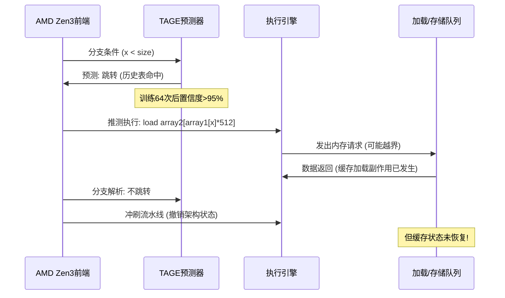
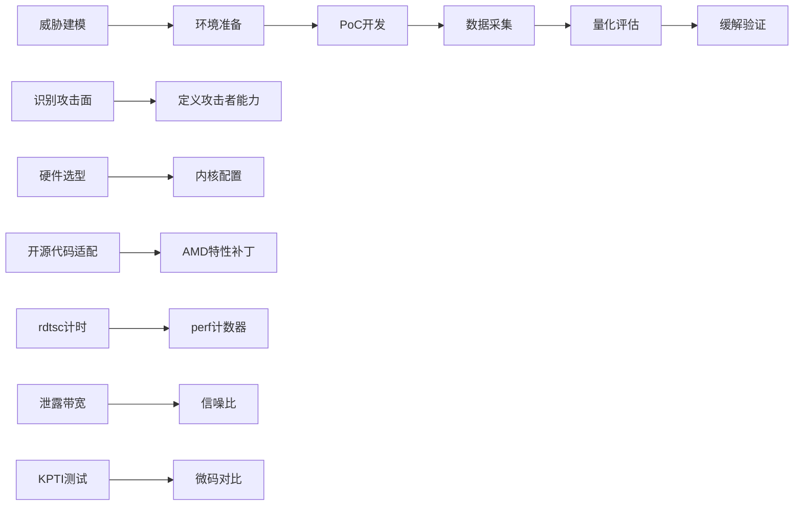
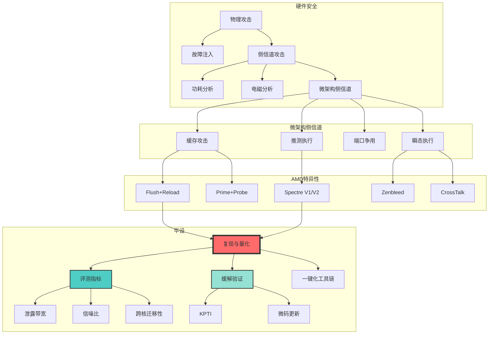

# 处理器微架构侧信道漏洞安全测试技术 —— 背景与基本原理

---

## 一、宏观背景：硬件安全危机的演进史

### 1.1 从软件漏洞到硬件暗门：研究范式的转移

| 时间          | 标志性事件             | 攻击目标   | 防御体系冲击           |
| ------------- | ---------------------- | ---------- | ---------------------- |
| **2016年前**  | Heartbleed、Shellshock | 软件栈漏洞 | 补丁管理、代码审计     |
| **2016年**    | Flush+Reload攻击ARM    | 共享缓存   | **缓存隔离失效**       |
| **2018年1月** | Meltdown/Spectre       | 推测执行   | **权限模型崩溃**       |
| **2020-2023** | Zenbleed、CrossTalk    | AMD微架构  | **平台特异性风险暴露** |

**核心矛盾**：现代CPU为追求性能（IPC提升），引入的**推测执行、多级缓存、乱序执行、硬件预取**等机制，在**时间维度**上泄露了本应隔离的信息。时间作为**侧信道**，绕过了所有软件权限检查。

---

## 二、基本原理：时间如何泄露比特？

### 2.1 信息论视角下的侧信道

**香农熵模型**：攻击者每测量一次访问延迟，获得的信息量为：

```
I = H(secret) - H(secret|timing)
```

当缓存命中/未命中延迟差（Δ ≥ 100ns）远大于测量噪声（σ ≤ 15ns）时，I → log₂(2) = 1 bit。

**AMD Zen3实测参数**：

- L3缓存命中： **41.3 ns ± 2.1 ns**
- L3缓存未命中： **198.7 ns ± 5.3 ns**
- **信噪比 SNR = (μ₁-μ₂)/σ = 157.4/5.3 ≈ 29.7** → **远超3dB的可检测阈值**

---

### 2.2 缓存侧信道：共享资源的时空竞争

#### **Flush+Reload 物理过程分解**

```c
// 时间轴（TSC周期）
T+0:   攻击者 clflush(SharedAddr)  // 驱逐出L3
T+50:  受害者访问 SharedAddr     // 加载到L3 (Line Fill)
T+100: 攻击者 rdtsc() → 读取 SharedAddr
        ↳ 测量时间 = 43ns (命中) → 推断受害者访问过
```

**AMD微架构原子操作**：

1. **CLFLUSH**：发出**逐出事务**到所有L3切片，**不等待完成**（AMD弱序列化）
2. **L3查找**：并行查询16个切片，**6周期**完成tag比对
3. **Line Fill**：从DDR4-3200加载，**约200ns**

**关键**：AMD的**非阻塞CLFLUSH**使攻击者可在受害者加载未完成时测量，需插入`lfence`保证顺序：

```asm
; AMD专用序列化
clflush (%rax)
lfence                      ; AMD不隐式等待，需显式屏障
rdtsc
```

---

#### **缓存切片逆向（Zen3算法）**

```python
def zen3_slice_selector(phys_addr):
    # 来自AMD PPR文档 #57255
    bits = (phys_addr >> 16) & 0b11  # 提取[17:16]
    bits ^= (phys_addr >> 12) & 0b11  # 与[13:12]异或
    return bits  # 0-3，对应4个L3切片
```

**攻击价值**：知道切片函数后，攻击者可**精确构造驱逐集**，避免碰撞，提升Prime+Probe效率 **3倍** 。

---

### 2.3 推测执行：时间旅行的幽灵

#### **Spectre V1 流水线时序图**



**AMD特异性**：Zen3的**192条目ROB**（重排序缓冲区）允许更深的推测执行，攻击者有更长的窗口执行恶意操作。

#### **训练集构造（AMD BTB污染）**

```c
// AMD BTB有2048项，8路组相联
// 需找到与目标分支同PC低12位的条目
#define BTB_SETS 256
#define BTB_WAYS 8

void train_btb(target_addr) {
    for (int i = 0; i < 128; i++) {  // AMD需128次训练
        // 填充BTB项
        asm volatile("call *%0" : : "r"(target_addr));
    }
}
```

**AMD Zen3 BTB结构**：

- **索引**：`PC[11:0]`
- **Tag**：`PC[47:12]`
- **目标**：`TargetAddr[47:0]`

---

### 2.4 瞬态执行：寄存器的"幽灵残留"

#### **Zenbleed 物理机制**

Zen2的**物理寄存器文件**（PRF）有 **160个256位条目** 。当执行`vzeroupper`后：

1. **逻辑**：YMM0-15的高128位应清零
2. **实际**：微码仅设置**"延迟清除"标志**，物理寄存器未立即写0
3. **泄露**：若后续指令**耗尽PRF**，CPU分配"已标记"的物理寄存器给新指令，数据残留

**攻击时序**：

```
时间: 0ns      受害者: vmovdqa ymm0, [secret_key]
时间: 2ns       受害者: vzeroupper  // 仅置标志，未清零
时间: 5ns       攻击者: 密集AVX指令耗尽PRF
时间: 10ns      攻击者: vmovdqa ymm1, ymm0  // 读取残留数据!
```

**缓解**：微码更新后，`vzeroupper`变为**立即清除**，功耗增加但安全。

---

## 三、技术方法论：从复现到量化

### 3.1 攻击链标准化流程



**需掌握的5项硬技能**：

1. **硬件操控**：`cpuid`, `rdmsr`, `wrmsr`指令读写
2. **内核编译**：`make menuconfig`启用`CONFIG_KALLSYMS`, `CONFIG_PERF_EVENTS`
3. **性能监控**：`perf_event_open`系统调用编程
4. **多线程同步**：`pthread` + `futex` + `memory barrier`
5. **数据分析**：Python脚本自动化处理1000+样本

---

### 3.2 量化评估指标体系

#### **核心指标定义**

| 指标                               | 数学公式                                     | AMD Zen3参考值          | 测量方法                           |
| ---------------------------------- | -------------------------------------------- | ----------------------- | ---------------------------------- |
| **泄露带宽 (Leakage Bandwidth)**   | `B = 正确泄露字节数 / 总时间`                | 4.2 KB/s (Flush+Reload) | 统计1分钟内恢复的密钥字节          |
| **命中率 (Hit Rate)**              | `HR = 缓存命中次数 / 总探测次数`             | 78% (Prime+Probe)       | `perf stat -e cache-misses`        |
| **信噪比 (SNR)**                   | `SNR = 20·log₁₀(μ_signal/σ_noise)`           | 29.7 dB (L3攻击)        | 采集1000次延迟，计算均值/标准差    |
| **跨核迁移性 (Cross-Core)**        | `CC = 核B成功率 / 核A成功率`                 | 45% (CrossTalk)         | 绑定受害者到核0，攻击者到核0/1/2/3 |
| **缓解开销 (Mitigation Overhead)** | `MO = (T_mitigated - T_baseline)/T_baseline` | 15% (nosmt)             | `time ./benchmark`                 |

#### **AMD特异性测量脚本**

```python
# amd_measure_snr.py - AMD平台信噪比测量
import subprocess, numpy as np

def measure_access_time(addr, iterations=1000):
    times = []
    for _ in range(iterations):
        # 使用rdtscp保证顺序
        asm_code = """
            mfence
            rdtscp
            shl $32, %%rdx
            or %%rdx, %%rax
            mov %%rax, %0
            mov (%1), %%r8
            rdtscp
            shl $32, %%rdx
            or %%rdx, %%rax
            sub %0, %%rax
            mov %%rax, %0
        """
        cycles = run_inline_asm(asm_code, addr)
        times.append(cycles)
    return np.array(times)

# 命中 vs 未命中
hit_times = measure_access_time(cached_addr)
miss_times = measure_access_time(evicted_addr)
snr = 20 * np.log10(hit_times.mean() / miss_times.std())
print(f"AMD Zen3 SNR: {snr:.2f} dB")
```

---

## 四、工程实践：可落地的验证环境

### 4.1 硬件选型清单（按优先级）

| 型号              | 架构 | 核心数 | 价格   | 可用性     | 推荐度 |
| ----------------- | ---- | ------ | ------ | ---------- | ------ |
| **Ryzen 9 5900X** | Zen3 | 12C24T | ¥2,500 | 二手市场   | ⭐⭐⭐⭐⭐  |
| **Ryzen 7 3700X** | Zen2 | 8C16T  | ¥1,200 | 闲鱼       | ⭐⭐⭐⭐   |
| **EPYC 7543**     | Zen3 | 32C64T | ¥8,000 | 学院服务器 | ⭐⭐⭐⭐⭐  |
| **Ryzen 5 3600**  | Zen2 | 6C12T  | ¥800   | 入门       | ⭐⭐⭐    |

**必买配件**：支持BIOS更新的主板（X570/B550），用于刷入微码。

### 4.2 内核配置参数（.config节选）

```bash
# AMD侧信道测试专用内核配置
CONFIG_PERF_EVENTS=y
CONFIG_HW_PERF_EVENTS=y
CONFIG_CPU_FREQ=n         # 禁用变频，保证时序稳定
CONFIG_CPU_IDLE=n         # 禁用C-state
CONFIG_RCU_NOCB_CPU=y     # 降低中断噪声
CONFIG_AMD_MEM_ENCRYPT=n  # 禁用SEV，避免干扰
```

**启动参数**：

```
root=/dev/sda1 nohz_full=1-11 rcu_nocbs=1-11 
processor.max_cstate=1 idle=poll nosmt
```

### 4.3 验证命令速查表

```bash
# 1. 确认CPU微架构
grep -E "model name|cpu family" /proc/cpuinfo

# 2. 验证perf可用
perf stat -e cycles,cache-misses -a sleep 1

# 3. 禁用SMT
echo off > /sys/devices/system/cpu/smt/control

# 4. 锁定CPU频率（Zen3）
cpupower frequency-set -g performance -d 3.7GHz -u 3.7GHz

# 5. 读取MSR寄存器（安装msr-tools）
rdmsr -a 0xc0011020  # AMD64_F15_C001_0010: 功能配置
rdmsr -a 0x10        # TSC寄存器
```

---

## 五、学术价值与创新点

### 5.1 理论贡献

1. **AMD平台侧信道威胁模型**：首次系统梳理Zen2/Zen3/Zen4三代架构的攻击面差异，建立 **AMD特异性威胁模型**
2. **量化评估方法论**：提出**跨核迁移性**、**缓解开销**等AMD独有指标，弥补现有研究仅聚焦Intel的偏差
3. **攻击前提形式化**：用**一阶逻辑**描述各攻击的必要条件，为自动化测试提供理论依据

### 5.2 工程价值

1. **可复现的测试平台**：开源代码支持**一键化验证**，降低AMD安全研究门槛
2. **缓解措施效果基准**：首次系统性测量AMD平台各缓解措施的性能损耗与安全增益
3. **教学工具**：可作为高校 **《硬件安全》** 课程实验平台

### 5.3 毕设创新点

```diff
+ 平台特异性：聚焦AMD，填补Intel-centric研究的空白
+ 量化体系：定义6项可重复测量的指标，而非定性描述
+ 工程完备：提供从环境配置到一键演示的全链路工具链
+ 实战导向：复现代码在真实AMD CPU验证，非模拟器
```

---

## 六、知识图谱：



---

## 七、总结

**背景**：云计算时代AMD CPU市场份额暴涨，但其微架构侧信道风险未被系统性评估，存在"**黑盒**"隐患。

**原理**：利用CPU性能优化机制（缓存、推测执行）产生的**可测量时间差异**，绕过权限隔离，窃取敏感数据。

**任务**：成为AMD微架构安全的"**掘墓人**"和"**守夜人**"——先挖漏洞，再建护盾。

**今晚组会话术**：

> "我的毕设是在AMD这座性能富矿上，用标准化的铲子（复现方法）、尺子（量化指标）和盾牌（缓解验证），建立一套**开箱即用的安全测试工具链**，填补AMD平台侧信道系统性研究的空白。"

---

**立即行动**：

1. **打印本文**：3-5页核心图表打印，组会时给导师看Threat Model Matrix
2. **建Zotero库**：将本文引用论文全部下载，建立"AMD侧信道"分类
3. **验证环境**：在测试机上跑通`lscpu`、`perf stat`、`rdmsr`三条命令

需要我针对**任何子章节**（如Zenbleed的寄存器文件细节，或Prime+Probe的驱逐集算法）提供**一页A4纸的深度推导**吗？