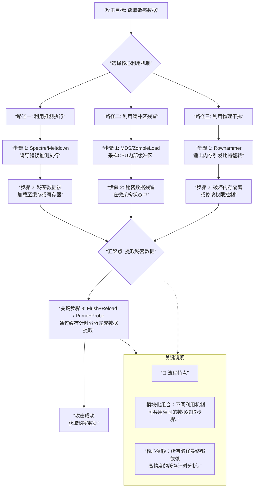

| 教科书分类（攻击渠道） | 对应微架构侧信道攻击示例                             | 核心利用机制                                                 | 关联说明                                                     |
| :--------------------- | :--------------------------------------------------- | :----------------------------------------------------------- | :----------------------------------------------------------- |
| **时序攻击**        | **Flush+Reload**、**Prime+Probe** 等缓存侧信道攻击   | 利用**缓存命中/未命中的时间差**推断访问模式。                | 这是微架构侧信道攻击最常见的形式，所有基于缓存的攻击本质上都是时序攻击。 |
|                        | **Spectre**、**Meltdown** 等推测执行攻击             | 利用**错误推测执行在缓存中留下的痕迹**，再通过时序差提取数据。 | 推测执行本身不直接泄露数据，需依赖缓存时序攻击作为“最后一步”完成信息提取。 |
| **功耗分析攻击**    | 通常不直接对应具体的微架构漏洞名称。                 | 通过测量芯片**功耗波动**推断操作类型与数据值。               | 功耗分析主要针对密码硬件，与微架构攻击的关联较弱，但都属于物理侧信道。 |
| **电磁侧信道攻击**  | 通常不直接对应具体的微架构漏洞名称。                 | 通过捕获设备发出的**电磁辐射**还原内部操作与数据。           | 同样属于物理侧信道，与微架构攻击的直接关联较小。             |
| **故障注入攻击**    | **Rowhammer**（行锤）                                | 通过**频繁访问特定内存行**，引发相邻行比特翻转，破坏内存隔离性。 | Rowhammer 通过物理干扰注入故障，属于主动故障注入攻击的一种。 |
|                        | **电压/时钟故障注入**（如Glitch攻击）                | 通过**操纵电压或时钟**导致处理器执行错误，跳过安全检查。     | 这类攻击通常用于破解安全启动、密码验证等，与微架构漏洞的关联较间接。 |
| **缓存攻击**        | **Flush+Reload**、**Prime+Probe**、**Evict+Time** 等 | 直接利用**缓存状态的变化**作为侧信道。                       | 缓存攻击是时序攻击的一个子集，也是微架构侧信道攻击中最核心的技术。 |

### 🔍 两种分类的异同与整合意义
- **相同点**：两者都旨在通过**非直接访问**的方式（即侧信道）窃取信息或破坏系统安全。
- **不同点**：
    - **教科书分类**更侧重于攻击的**物理或逻辑泄露渠道**（如时间、功耗、电磁、故障），涵盖了所有硬件层面。
    - **微架构分类**更侧重于攻击**具体的处理器优化机制**（如推测执行、缓存、缓冲区等），是教科书分类中“时序攻击”和“缓存攻击”在**现代CPU上的具体实现和演进**。

- **整合意义**：将两种视角结合，能帮助你更系统地理解侧信道攻击的**全貌**。例如，一个完整的 Spectre 攻击，从攻击渠道看属于**时序攻击**，从利用的硬件机制看则属于**推测执行攻击**，其数据提取阶段又依赖于**缓存攻击**。

### 🎯 深入理解几种主要攻击

- **推测执行攻击**：这是最核心的一类。以 **Spectre** 为例，攻击者首先“训练”处理器的分支预测器，使其做出错误判断。当处理器基于错误预测进行推测执行时，会执行到一段本不该被访问的、包含敏感数据的代码路径，并**在缓存中留下痕迹**。随后，攻击者再通过 **Flush+Reload** 等缓存侧信道技术分析这些痕迹，从而还原出敏感数据。

- **微架构数据采样**：这类攻击不直接依赖推测执行，而是**利用CPU内部各种缓冲区的残留数据**。例如，当CPU核心在读取、存储或加载数据时，这些数据会临时存放在微架构缓冲区中。MDS攻击可以“采样”这些不同核心间可能未及时清理的旧数据，从而跨安全边界窃取信息。

- **缓存侧信道攻击**：这是**提取信息的通用技术**，常作为其他攻击的最后一步。例如在Flush+Reload攻击中，攻击者先将一段共享内存从缓存中“清除”（Flush），然后等待受害者程序执行。如果受害者访问了该内存，数据会被重新加载进缓存，攻击者随后“重载”（Reload）同一内存并**精确测量访问时间**，时间短则证明数据在缓存中，从而推断出受害者的行为。

总而言之，安全测试中设计的这些攻击，其核心思路都是**将处理器为了性能而暴露的微架构状态（如缓存命中/未命中、执行时间）转化为信息泄露的渠道**。针对这些漏洞的缓解措施通常需要软硬件结合，包括部署处理器微码更新、操作系统补丁（如内核页表隔离），以及在编程中采用恒定时间算法等。

---

**组合攻击流程**，以及不同攻击手段在其中扮演的角色和顺序：

### 🎯 流程核心解读

1.  **技术角色与执行顺序**：
    *   **第一阶段 (创造秘密访问/状态)**：攻击始于利用一种核心的微架构缺陷（如 `Spectre` 的错误推测、`MDS` 的缓冲区采样、`Rowhammer` 的故障注入）来**非正常地访问或影响敏感数据**。这些数据会以某种形式（如缓存状态、寄存器值）残留下来。
    *   **第二阶段 (提取秘密数据)**：随后，攻击者**必须使用** `Flush+Reload` 或 `Prime+Probe` 这类缓存侧信道计时攻击技术，作为**通用的“数据提取引擎”**，将第一步留下的、不可直接读取的微架构状态痕迹，转化为实际可推断的信息比特。
    *   **并列与组合关系**：如图中三条并行的起始路径所示，`Spectre`、`MDS`、`Rowhammer` 等是**并列**的、不同层面的“漏洞利用机制”。但它们往往需要**串联**同一个“数据提取机制”（缓存计时攻击）来完成攻击闭环。

2.  **一个典型攻击链实例 (Spectre)**：
    *   **先后顺序**：`Spectre (V1)` → **`Flush+Reload`**。
    *   **具体步骤**：
        1.  **利用Spectre**：训练分支预测器 → 诱导错误推测执行 → 在推测执行中访问秘密数据 → 该操作**将秘密数据对应的内存地址加载到缓存中**。
        2.  **利用Flush+Reload**：攻击者**主动刷新**（Flush）一个与秘密数据地址有映射关系的探测地址 → 等待短暂时间 → 然后**重载**（Reload）该地址并精确计时 → 通过极短的访问时间判断出该地址已在缓存中，从而反推出秘密数据的值。

### 💡 重要总结
这个流程图的关键在于揭示：**现代复杂的微架构攻击本质上是“漏洞利用机制”和“数据提取机制”的模块化组合**。`Flush+Reload` 这类缓存侧信道技术，因其高精度和可靠性，已成为绝大多数此类攻击**最终、且必不可少**的数据提取环节。

