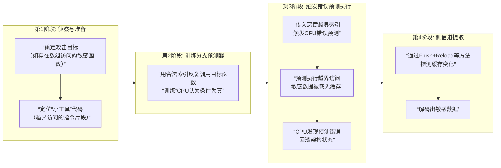

**Spectre V1**，它也被称为 **“边界检查绕过”**。与利用间接分支的V2不同，V1攻击的是程序中最常见的安全检查——**条件分支**。

### 🔍 核心原理：利用条件分支的方向误预测
现代CPU采用**分支预测**来猜测`if`条件判断的结果是“真”还是“假”，从而提前执行相应的代码路径，以保持流水线满载。

**Spectre V1的攻击核心，就是恶意“训练”CPU，使其对一个本应为“假”的安全检查（例如数组越界检查）做出“真”的错误预测。**

这个攻击之所以被称为“幽灵”，是因为CPU在发现预测错误后，会**回滚所有架构状态**，仿佛错误预测的代码从未执行过。然而，这些代码在预测执行期间对**微架构状态（尤其是缓存）的更改却被保留了下来**，成为泄露信息的侧信道。

### 📊 攻击步骤详解
我们以一个经典的越界读攻击为例，其攻击流程可以分解为以下关键阶段：



结合一段典型的**存在漏洞的伪代码**，来具体说明攻击者如何利用上述流程：

```c
// 存在Spectre V1漏洞的示例代码
int victim_function(size_t index) {
    int array1[64] = {...}; // 普通数组
    int array2[256 * 512];  // 一个大的预备数组，用于侧信道编码
    
    // 关键的安全检查（边界检查）
    if (index < array1_size) { // 步骤1：攻击者训练CPU，使其总是预测此条件为“真”
        // 步骤2：预测执行会进入这里。攻击者传入一个越界的`index`
        int value = array1[index]; // 步骤3：越界读取到机密数据，例如一个字节`secret`
        
        // 步骤4：机密数据控制后续微架构状态
        // 假设`secret`的值为0x42，则访问array2中偏移为0x42*512的缓存行
        int index2 = ((value) * 512); // 将秘密数据转化为缓存行索引
        temp &= array2[index2]; // 该访问会将特定缓存行载入CPU缓存
    }
    // 步骤5：CPU发现index越界，回滚所有架构状态，但array2的缓存状态已被改变
    return 0;
}
```

在上例中，攻击者通过`array2`的缓存访问模式（哪些缓存行被载入），即可反向推断出`value`（即机密数据）的值。

### ⚠️ 影响与利用场景
Spectre V1的可怕之处在于：
1.  **普遍性**：任何包含**条件分支+数组访问**模式的代码都可能成为攻击目标。这种模式在系统软件、浏览器JIT引擎、加密库中极其常见。
2.  **跨安全域**：可以用于从浏览器沙箱中窃取数据、在云环境中跨虚拟机窃取信息，或从内核中读取敏感数据。
3.  **利用“小工具”**：攻击者**不需要注入自己的代码**，而是寻找并利用受害者程序中**已经存在的、符合模式的代码片段**来实施攻击。

### 🛡️ 缓解措施
由于是硬件设计缺陷，修复需软硬件协同：
1.  **软件缓解**：编译器在敏感的条件分支后插入**序列化指令**（如 `LFENCE`），确保安全检查后的代码不会在结果确认前被预测执行。
2.  **编程实践**：编写**恒定时间编程**的安全关键代码，确保其执行时间和内存访问模式不依赖于秘密数据。
3.  **硬件缓解**：新一代CPU（如Intel的Coffee Lake-R后，AMD的Zen 3后）增强了分支预测器的隔离性。在AMD平台上，操作系统会利用CPU提供的 `IBPB`（间接分支预测屏障）等硬件特性，在上下文切换时清理预测器状态。

总而言之，**Spectre V1揭示了现代CPU性能优化（分支预测）与程序安全语义（边界检查）之间的根本矛盾**。它利用最基础的代码模式发起攻击，是理解整个Spectre漏洞家族的基石。
