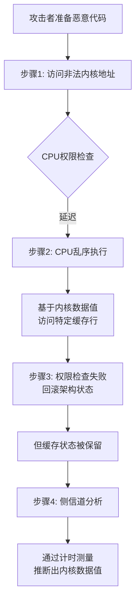

Meltdown（熔断）是2018年初与Spectre同时公开的CPU硬件漏洞，它**打破了用户程序与操作系统内核之间最核心的隔离墙**，允许低权限的用户程序读取高权限内核空间的内存数据。

### 🔥 核心攻击原理：乱序执行与权限检查的漏洞
现代CPU的**乱序执行**优化是Meltdown攻击的根源。为了让内核（操作系统核心）访问数据更快，CPU会将**用户空间和内核空间的内存映射到同一个地址空间**，仅通过一个权限位来区分。

> [!NOTE]
>
> **乱序执行** 是CPU用"空间换时间"的策略，通过硬件复杂度换取指令级并行度，是现代高性能处理器不可或缺的基石。

理想情况下，用户程序访问内核内存时，CPU的权限检查会立即阻止。但为了性能，**权限检查实际上被延迟了**：CPU会基于预测，先**乱序执行**后续可能无效的指令。如果预测错误，CPU会回滚状态，但**一些微架构状态（如缓存）不会被清除**，这成为了信息泄露的侧信道。

### 📊 Meltdown攻击的四个步骤
下面的流程图清晰地展示了攻击者利用这一漏洞窃取内核数据的完整过程：

### 🆚 与Spectre的根本区别
虽然Meltdown和Spectre都利用预测执行和侧信道，但它们在本质上截然不同：

| 特性         | **Meltdown**                        | **Spectre**                        |
| :----------- | :---------------------------------- | :--------------------------------- |
| **攻击目标** | 跨越 **权限层级（内核↔用户）**      | 跨越 **软件信任边界（进程↔进程）** |
| **利用核心** | CPU的**乱序执行**与**权限检查延迟** | CPU的**分支预测**机制              |
| **依赖条件** | 几乎不需要了解受害者内存布局        | 需要了解受害者代码或内存布局       |
| **影响范围** | **更窄**，主要影响Intel、部分ARM    | **极广**，几乎影响所有现代处理器   |
| **数据读取** | 可以连续读取任意内核内存            | 通常受限于受害者地址空间           |

简单来说，Meltdown是 **“直接拆墙”** （破坏硬件隔离），而Spectre是 **“诱导欺骗”** （利用软件预测）。

### ⚠️ 影响与缓解
*   **影响**：Meltdown主要影响**Intel处理器**（自1995年后的多数型号）和部分ARM设计。有趣的是，绝大多数**AMD处理器不受影响**，因为其硬件的权限检查机制不同。
*   **缓解措施 - KPTI**：最主要的软件修复方案是**内核页表隔离**。它彻底分离了用户与内核的页表映射，虽然牺牲了约5-30%的系统调用性能开销，但从根本上堵住了漏洞。

总结来说，Meltdown因其攻击的直接性和严重性，彻底改变了业界对CPU硬件安全性的认知。