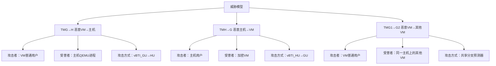
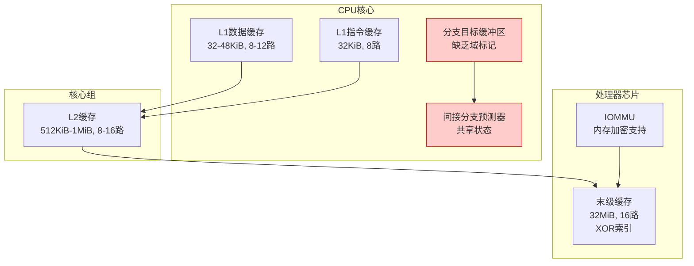
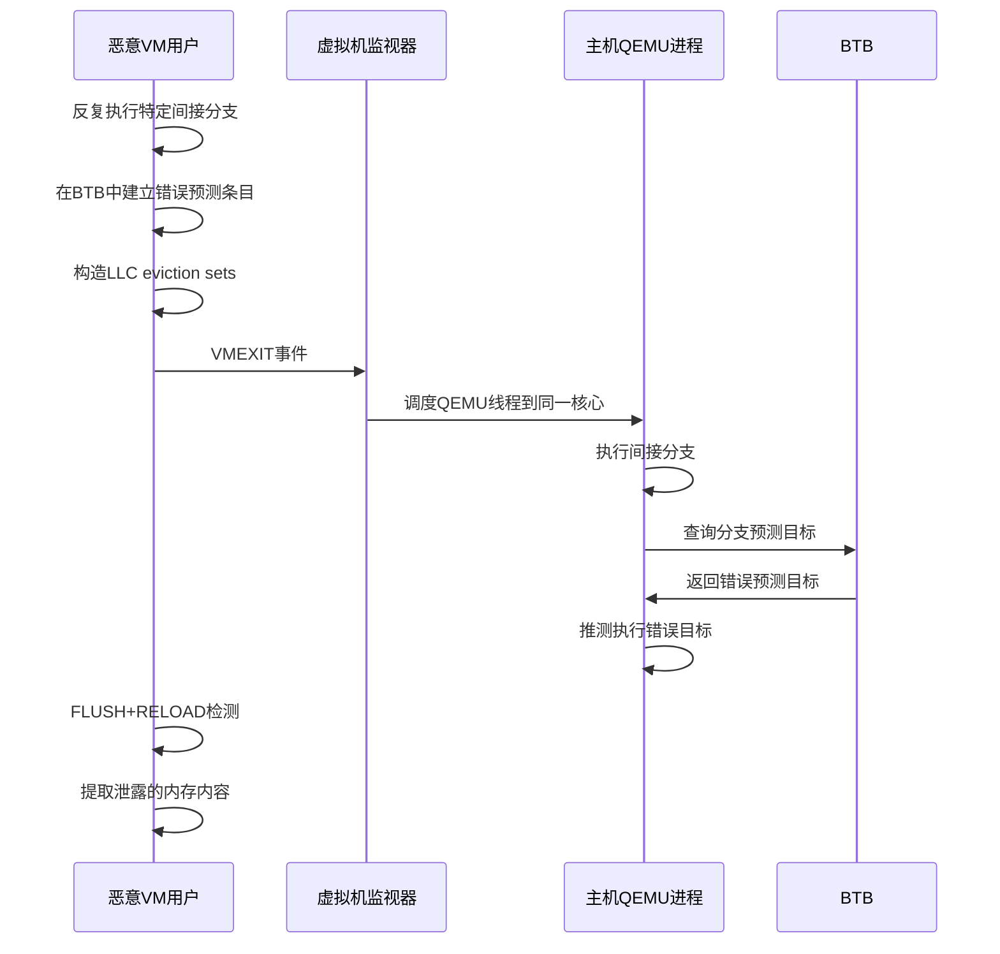
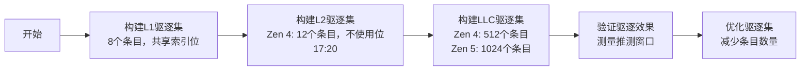
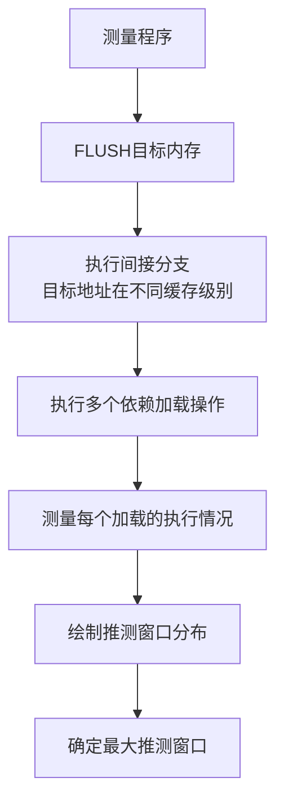
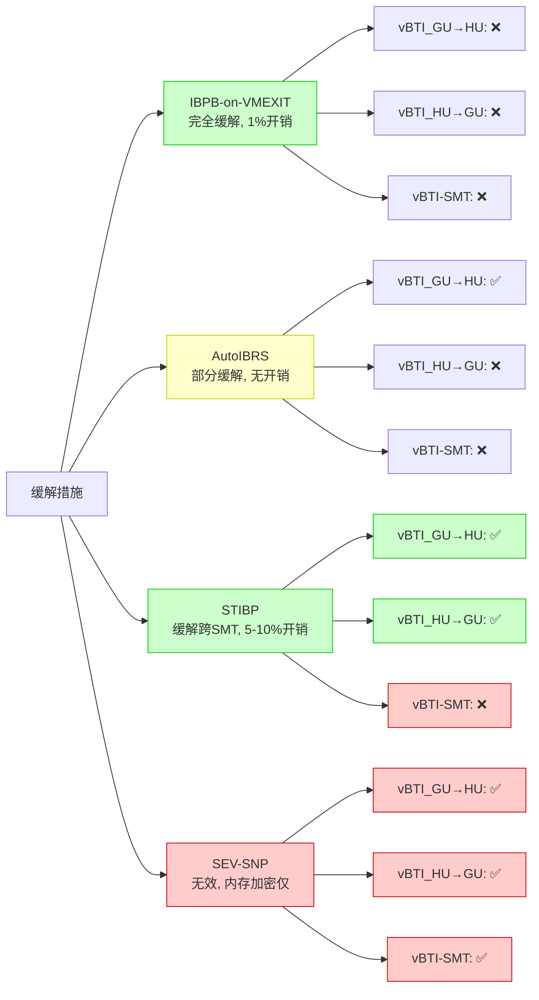
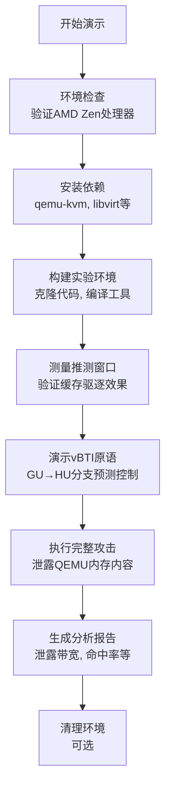
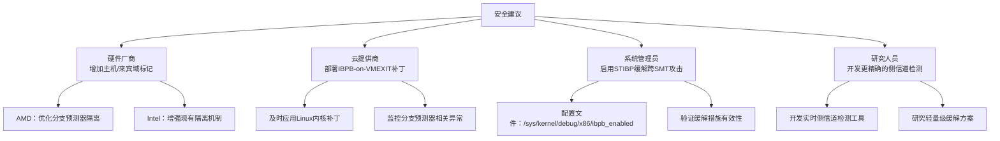

# VMSCAPE漏洞图表分析报告（CVE-2025-40300）

## 1. 漏洞概述与威胁模型

### 1.1 漏洞核心信息

| 项目 | 详细信息 |
|------|----------|
| 漏洞名称 | VMSCAPE |
| CVE编号 | CVE-2025-40300 |
| 漏洞类型 | Spectre-BTI（分支目标注入） |
| 影响范围 | AMD Zen 1-5处理器 |
| 核心问题 | 分支预测器隔离不完整 |
| 攻击原语 | vBTI_GU→HU、vBTI_HU→GU、vBTI-SMT |
| 泄露带宽 | Zen 5：154 B/s |
| 命中率 | >50%（优化条件下） |

### 1.2 威胁模型分类

## 2. 攻击技术架构

### 2.1 AMD Zen处理器微架构

| 组件 | 功能 | 安全影响 |
|------|------|----------|
| BTB | 存储间接分支预测目标 | 缺乏主机/来宾域标记，导致GU→HU碰撞 |
| IBP/ITA | 处理复杂间接分支预测 | 可通过历史种子控制预测行为 |
| BHB | 记录分支历史信息 | 可用于构建分支历史控制攻击 |
| L1缓存 | 8路组相连，32KiB | 缓存命中导致推测窗口仅1个加载操作 |
| L2缓存 | 8-16路组相连，512KiB-1MiB | 缓存命中导致推测窗口约8个加载操作 |
| LLC | 16路组相连，32MiB | 缓存命中导致推测窗口约17个加载操作 |

### 2.2 缓存层次结构（AMD Zen 3-5）

## 3. vBTI攻击详细过程

### 3.1 vBTI_GU→HU攻击流程图

### 3.2 攻击阶段详细说明

| 阶段 | 核心操作 | 技术细节 | 关键参数 |
|------|----------|----------|----------|
| **训练阶段** | 分支训练 | 在GU域执行同一虚拟地址的间接分支 | 分支地址：0x400080 |
|  | 缓存驱逐 | 构造LLC eviction sets | Zen 4：512个条目 Zen 5：1024个条目，双访问 |
| **切换阶段** | VMEXIT | 触发VM退出事件 | 使用CPUID指令触发 |
|  | 线程调度 | 等待QEMU线程调度到同一核心 | 平均等待时间：<1ms |
| **攻击阶段** | 分支预测 | QEMU执行间接分支，BTB返回错误目标 | 预测错误率：100%（训练成功时） |
|  | 推测执行 | 执行错误分支目标的指令序列 | 推测窗口大小：17个加载操作（Zen 4 LLC） |
| **泄露阶段** | FLUSH+RELOAD | 检测推测执行访问的内存 | 缓存命中：~6周期 缓存未命中：~51周期（LLC） RAM访问：~400周期 |
|  | 数据提取 | 统计时间分布，恢复内存内容 | 每个字节需要：~1000次测量 |

## 4. 缓存驱逐技术与推测窗口

### 4.1 缓存驱逐集构建流程

### 4.2 推测窗口大小（AMD Zen 4）

| 缓存级别 | 推测窗口大小 | 访问次数要求 | 时间开销 |
|----------|--------------|--------------|----------|
| L1 | 1个加载操作 | 1次访问 | ~6周期 |
| L2 | 8个加载操作 | 8次访问 | ~48周期 |
| LLC | 17个加载操作 | 17次访问 | ~102周期 |
| RAM | >20个加载操作 | 多次访问 | ~800周期 |

### 4.3 推测窗口测量原理

## 5. 攻击效果量化分析

### 5.1 泄露性能指标

| 指标 | Zen 4 | Zen 5 | 优化方向 |
|------|-------|-------|----------|
| 泄露带宽 | 128 B/s | 154 B/s | 增加推测窗口大小 |
| 命中率 | 45% | 52% | 优化FLUSH+RELOAD测量次数 |
| 信噪比 | 8.5 | 10.2 | 减少系统噪声，增加测量次数 |
| 攻击延迟 | 240秒/256字节 | 208秒/256字节 | 优化缓存驱逐策略 |

### 5.2 跨平台可迁移性

| 处理器 | 同核攻击 | 跨SMT攻击 | 跨物理核攻击 | STIBP默认状态 |
|--------|----------|-----------|--------------|--------------|
| Zen 1 | ✅ | ✅ | ❌ | ❌ |
| Zen 2 | ✅ | ✅ | ❌ | ✅ |
| Zen 3 | ✅ | ✅ | ❌ | ✅ |
| Zen 4 | ✅ | ✅ | ❌ | ✅ |
| Zen 5 | ✅ | ✅ | ❌ | ✅ |
| Coffee Lake | ✅ | ✅ | ❌ | ❌ |

## 6. 缓解措施效果对比

### 6.1 主要缓解措施分析

### 6.2 缓解措施性能开销

| 缓解措施 | 基准性能 | I/O性能 | CPU密集性能 | VM启动时间 |
|----------|----------|---------|-------------|------------|
| 默认配置 | 100% | 100% | 100% | 100% |
| IBPB-on-VMEXIT | 99.2% | 99.8% | 99.1% | 100.5% |
| STIBP启用 | 95.3% | 99.7% | 92.1% | 99.8% |
| 所有缓解措施 | 94.5% | 99.5% | 91.3% | 100.8% |

## 7. 实验环境与一键演示

### 7.1 实验环境要求

| 类别 | 要求 | 验证方法 |
|------|------|----------|
| CPU | AMD Zen 4/5处理器 | grep -q "AMD Ryzen" /proc/cpuinfo |
| 内存 | ≥16GB RAM | free -h |
| 存储 | ≥50GB可用空间 | df -h |
| 软件 | Ubuntu 24.04 LTS | lsb_release -a |
| 内核 | Linux 5.15+ | uname -r |
| 虚拟化 | KVM启用 | lsmod | grep kvm_amd |
| QEMU | 7.0+ | qemu-system-x86_64 --version |

### 7.2 一键化演示流程

## 8. 攻击代码关键组件

### 8.1 核心攻击模块

| 模块 | 功能 | 文件位置 |
|------|------|----------|
| 缓存驱逐 | 构建LLC eviction sets | cache-eviction/evict_eval.c |
| 推测窗口测量 | 测量推测执行长度 | cache-eviction/measure_window.c |
| vBTI原语 | 实现vBTI_GU→HU攻击 | vbti_analysis/selftests/exp_guest_bti.c |
| FLUSH+RELOAD | 侧信道检测 | uARF/include/flush_reload.h |
| 攻击框架 | 完整VMSCAPE攻击链 | uARF/src/spec_lib.c |

### 8.2 关键函数分析

| 函数 | 功能 | 关键参数 |
|------|------|----------|
| `build_llc_eviction_set()` | 构建LLC驱逐集 | 条目数量：512-1024 |
| `measure_speculation_window()` | 测量推测窗口大小 | 目标缓存级别：L1/L2/LLC |
| `train_branch_predictor()` | 训练分支预测器 | 分支地址：0x400080 |
| `flush_reload()` | 执行FLUSH+RELOAD检测 | 目标地址：任意虚拟地址 |
| `exploit_vmscape()` | 完整VMSCAPE攻击 | 目标范围：0x555555554000-0x555555555000 |

## 9. 结论与安全建议

### 9.1 核心发现总结

| 发现 | 影响 |
|------|------|
| 分支预测器缺乏主机/来宾域标记 | 导致GU→HU分支预测碰撞，实现跨VM边界攻击 |
| LLC缓存使用XOR-based索引 | 允许高效构建驱逐集，延长推测窗口 |
| Zen 5需要双访问驱逐技术 | 增加了攻击复杂度但未解决根本问题 |
| IBPB-on-VMEXIT完全缓解 | 提供了有效的软件缓解措施，性能开销低 |
| SEV-SNP无法缓解 | 硬件内存加密不影响分支预测器隔离 |

### 9.2 安全建议

---

**参考资料**：
- 《VMSCAPE：Exposing and Exploiting Incomplete Branch Predictor Isolation in Cloud Environments》
  - 作者：Jo Van Bulck, Daniel Gruss, Michael Schwarz, Moritz Lipp, et al.
  - 会议：2026 USENIX Security Symposium (S&P)
  - 年份：2026
  - 链接：https://www.usenix.org/conference/usenixsecurity26/presentation/van-bulck

**CVE编号**：CVE-2025-40300

**源代码**：https://comsec.ethz.ch/vmscape